<div align="center">


</div>

<div align="center">

# 💖 SoulSync AI

### *Redefining Modern Matchmaking using Artificial Intelligence*


<br>


<br><br>

<a href="https://soul-sync-ai-ten.vercel.app">


</a>

&nbsp;

<a href="https://github.com/TheKanishkDev/SoulSync-AI">


</a>

</div>

---

# 🌸 Welcome

SoulSync AI is a next-generation AI-powered matrimonial platform that transforms traditional matchmaking into a personalized, intelligent and meaningful experience.

Instead of relying solely on static profile filters, SoulSync AI combines modern cloud architecture with Google Gemini AI to deliver compatibility analysis, relationship insights and AI-guided recommendations that empower users to make informed life decisions.

---

# ✨ Why SoulSync AI?

<div align="center">

| Traditional Platforms | SoulSync AI |
|----------------------|-------------|
| Manual Profile Browsing | 🤖 AI Assisted Match Discovery |
| Static Biodata | 📊 AI Compatibility Reports |
| Basic Filters | ❤️ Smart Recommendations |
| Manual Decisions | 🎯 AI Decision Support |
| No Guidance | 💬 AI Relationship Advisor |
| Limited Communication | ⚡ Real-Time Messaging |

</div>

---

# 🚀 Live Deployment

<div align="center">

| Platform | Status |
|----------|--------|
| 🌐 Frontend | **Vercel** |
| ⚙ Backend | **Render** |
| 🗄 Database | **Aiven MySQL** |
| ☁ Image Storage | **Cloudinary** |
| 🤖 AI Engine | **Google Gemini** |

</div>

---

# ⚡ Quick Access

<div align="center">

| Link | URL |
|------|-----|
| 🚀 Live Demo | https://soul-sync-ai-ten.vercel.app |
| ⚙ Backend API | https://soulsync-ai-8hyt.onrender.com |
| 📂 GitHub Repository | https://github.com/TheKanishkDev/SoulSync-AI |

</div>

---

# 💻 Tech Ecosystem

<div align="center">


<br><br>


</div>

---

# 🏆 Core Highlights

<div align="center">

| 🚀 Feature | Description |
|------------|-------------|
| 🤖 AI Powered | Google Gemini AI Integration |
| ❤️ Matchmaking | Intelligent Compatibility Analysis |
| 💬 AI Advisor | Personalized Relationship Guidance |
| 📊 Reports | AI Compatibility Reports |
| ⚡ Chat | Real-Time WebSocket Messaging |
| 🔐 Security | JWT Authentication |
| ☁ Cloud | Production Hosted Infrastructure |
| 📱 Responsive | Mobile Friendly UI |
| 📷 Media | Cloudinary Image Upload |
| 🎯 Architecture | Spring Boot REST APIs |

</div>

---

# 🧭 Repository Navigation

- 🌸 About SoulSync AI
- 📸 Application Showcase
- 👤 User Management
- ❤️ Smart Matchmaking
- 🤖 Artificial Intelligence
- 📊 AI Compatibility Reports
- 💬 AI Relationship Advisor
- 💬 Real-Time Messaging
- 🏗 System Architecture
- ⚙ Installation
- 🔐 Environment Variables
- 🚀 Deployment
- 📈 Performance
- 🔮 Roadmap
- 👨‍💻 Developer

---

# 🏗 High-Level Architecture

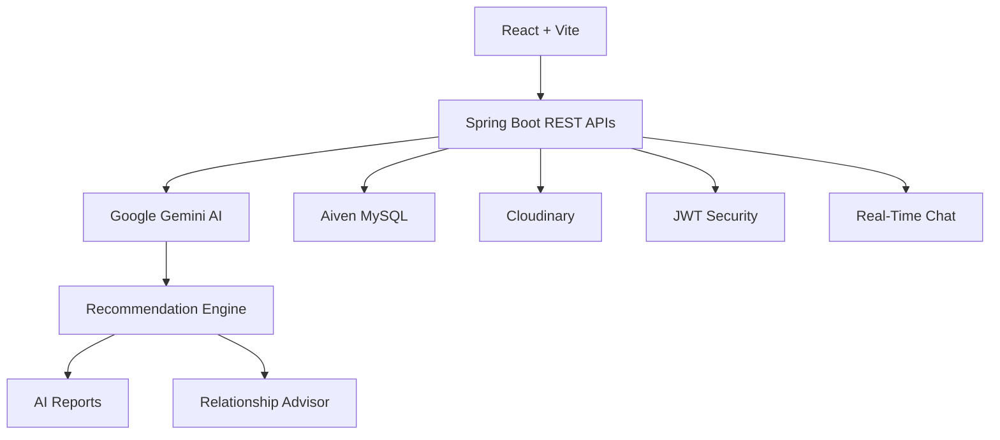

---

# 💡 Platform Philosophy

> **Finding the right life partner shouldn't depend only on filters.**
>
> SoulSync AI combines Artificial Intelligence with modern software engineering to help users discover compatibility beyond traditional matchmaking.

---
<div align="center">

# 🌍 Application Showcase

> *Every screen of SoulSync AI has been carefully crafted to provide a seamless, intelligent and delightful matchmaking experience.*

</div>

---

# 🏠 Landing Experience

<div align="center">


</div>

The landing page introduces users to the next generation of AI-powered matchmaking through an elegant interface, intuitive navigation and responsive design.

---

## 🌟 Highlights

| Feature | Description |
|----------|-------------|
| 🎨 Modern UI | Clean and elegant landing experience |
| 📱 Responsive | Optimized for every device |
| 🚀 Fast Loading | Built using React + Vite |
| ❤️ Beautiful Animations | Smooth user interactions |
| 🤖 AI Branding | Focus on intelligent matchmaking |

---

# 🔐 Secure Authentication

<div align="center">


</div>

---

Authentication is powered using **Spring Security + JWT Authentication**, ensuring secure login sessions while protecting user information.

---

## Authentication Features

<div align="center">

| 🔒 Security | ✔ |
|------------|---|
| JWT Authentication | ✅ |
| Password Encryption | ✅ |
| Session Protection | ✅ |
| Protected APIs | ✅ |
| Role Based Authorization | ✅ |

</div>

---

# 📝 User Registration

<div align="center">

### Step 1


<br><br>

### Step 2


</div>

---

The registration flow captures comprehensive user information required for intelligent compatibility analysis.

Instead of collecting only basic biodata, SoulSync AI builds rich user profiles for AI-driven matchmaking.

---

# 👤 User Management


---

## 👤 User Features

| Feature | Available |
|----------|-----------|
| Secure Registration | ✅ |
| Secure Login | ✅ |
| JWT Authentication | ✅ |
| Profile Editing | ✅ |
| Cloudinary Upload | ✅ |
| Dashboard | ✅ |
| Responsive Design | ✅ |

---

# ❤️ Intelligent Match Recommendation Engine

<div align="center">


</div>

Unlike conventional matrimonial platforms, SoulSync AI intelligently evaluates compatibility using multiple real-world dimensions instead of relying on simple profile filters.

---

## 🧠 AI Matching Parameters

<div align="center">

| Compatibility Factor | AI Analysis |
|----------------------|-------------|
| 📍 Location | ✅ |
| 🎓 Education | ✅ |
| 💼 Profession | ✅ |
| ❤️ Lifestyle | ✅ |
| 🚭 Smoking & Drinking | ✅ |
| 👨‍👩‍👧 Family Preferences | ✅ |
| 🛕 Religion | ✅ |
| 👶 Children Planning | ✅ |
| 🎯 Long-Term Goals | ✅ |
| 💬 Communication Readiness | ✅ |

</div>

---

# ❤️ AI Recommendation Flow

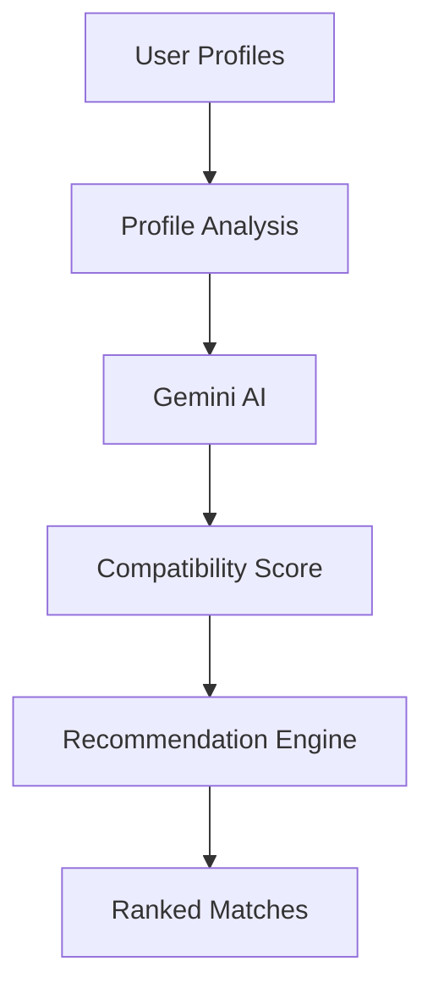

---

# 📊 Personalized Dashboard

<div align="center">


</div>

The dashboard serves as the heart of SoulSync AI, bringing together intelligent recommendations, AI services and personalized user management into one seamless experience.

---

## Dashboard Includes

<div align="center">

| Module | Description |
|---------|-------------|
| ❤️ Recommended Matches | Personalized recommendations |
| 🤖 AI Advisor | AI relationship guidance |
| 📊 Compatibility Overview | AI generated reports |
| 👤 Profile Management | Edit profile |
| 📨 Interest Requests | Manage requests |
| 💬 Messages | Real-time conversations |

</div>

---

# 👤 Detailed Match Profile

<div align="center">


</div>

Each recommended profile provides detailed information allowing users to make informed relationship decisions rather than relying solely on photographs or basic biodata.

---

## Available Information

| 👤 Personal | ❤️ Lifestyle | 💼 Career | 🤖 AI |
|-------------|--------------|-----------|-------|
| Age | Lifestyle | Profession | AI Report |
| Height | Habits | Income | AI Advisor |
| Religion | Interests | Education | Compatibility Score |
| Community | Family | City | Send Interest |

---

# 🌟 Why This Matters

Traditional matrimonial websites simply display profiles.

SoulSync AI explains **why two individuals are compatible**, making relationship discovery more meaningful, transparent and intelligent.

---

# 🔥 Core Platform Features

<div align="center">

| Category | Features |
|-----------|----------|
| 👤 User Management | Registration, Login, Dashboard |
| ❤️ Matchmaking | Smart Recommendations |
| 🤖 AI | Gemini Compatibility Reports |
| 💬 Communication | AI Advisor + Real-Time Chat |
| ☁ Cloud | Cloudinary, Render, Vercel |
| 🔐 Security | JWT + Spring Security |

</div>

---

<div align="center">


### 🤖 Artificial Intelligence begins here...

</div>

```
# 🤖 Artificial Intelligence Engine

<div align="center">


<br><br>

> *Artificial Intelligence is the heart of SoulSync AI.*

Instead of simply displaying profiles, SoulSync AI analyzes compatibility, predicts relationship strengths, identifies possible challenges and generates personalized recommendations using Google's Gemini AI.

</div>

---

# 🧠 AI Ecosystem

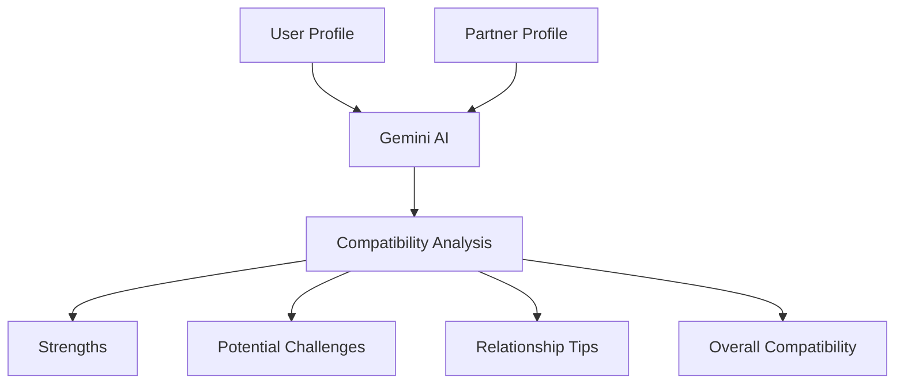

---

# 💡 What Makes SoulSync AI Different?

Traditional matrimonial websites depend almost entirely on filters such as age, religion, caste or city.

SoulSync AI goes several steps further by evaluating emotional compatibility, lifestyle alignment, communication patterns, long-term expectations and shared relationship values using Artificial Intelligence.

---

## 🚀 AI Modules

<div align="center">

| AI Module | Purpose |
|------------|---------|
| ❤️ Compatibility Analysis | Relationship evaluation |
| 💬 Relationship Advisor | Personalized guidance |
| 📊 AI Report Generator | Detailed compatibility report |
| 🎯 Smart Recommendations | Intelligent matchmaking |
| 🧠 Gemini Integration | Natural language reasoning |

</div>

---

# ❤️ AI Compatibility Report

<div align="center">


</div>

---

The Compatibility Report is one of the flagship features of SoulSync AI.

Instead of assigning a simple percentage score, Gemini AI generates a comprehensive narrative describing the overall relationship potential between two individuals.

---

# 📊 AI Report Includes

<div align="center">

| Report Section | Generated by AI |
|----------------|-----------------|
| Overall Compatibility | ✅ |
| Emotional Alignment | ✅ |
| Lifestyle Comparison | ✅ |
| Career Compatibility | ✅ |
| Family Expectations | ✅ |
| Communication Style | ✅ |
| Shared Values | ✅ |
| Potential Challenges | ✅ |
| Improvement Suggestions | ✅ |
| Final Verdict | ✅ |

</div>

---

# 📈 AI Report Workflow

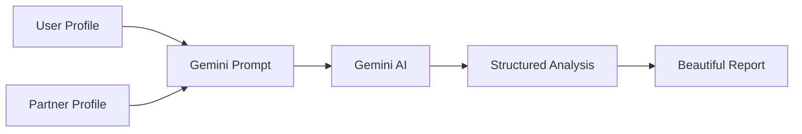

---

# 📋 Sample AI Evaluation

| Category | AI Insight |
|----------|------------|
| ❤️ Emotional Compatibility | Excellent |
| 👨‍👩‍👧 Family Values | Highly Compatible |
| 💼 Career Understanding | Strong |
| 🎯 Life Goals | Similar Vision |
| 🛕 Cultural Alignment | Good |
| 💬 Communication | Healthy Potential |
| 🌱 Growth Opportunities | Positive |
| ⭐ Overall Rating | Highly Recommended |

---

# 💬 AI Relationship Advisor

<div align="center">


</div>

---

Unlike ordinary chatbots, the AI Advisor understands relationship-related queries and provides thoughtful, context-aware suggestions.

It acts as a personal relationship mentor, helping users navigate conversations, compatibility concerns and long-term planning.

---

# 💡 Users Can Ask Questions Like

- ❤️ Are we emotionally compatible?
- 💬 How can I improve communication?
- 👨‍👩‍👧 Are our family expectations realistic?
- 💼 Will career differences affect our relationship?
- 🌍 Can long-distance relationships work?
- 🎯 What are our biggest strengths?
- ⚠️ What challenges should we prepare for?
- 💍 Are we suitable for marriage?

---

# 🤖 Advisor Processing Flow

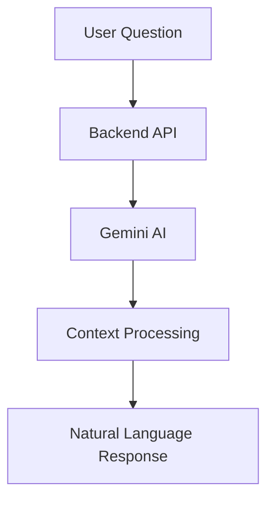

---

# 🎯 Benefits of AI Advisor

<div align="center">

| Capability | Available |
|-------------|-----------|
| Personalized Advice | ✅ |
| Natural Conversation | ✅ |
| Relationship Guidance | ✅ |
| Emotional Insights | ✅ |
| Lifestyle Suggestions | ✅ |
| Long-Term Planning | ✅ |

</div>

---

# 💬 Real-Time Messaging

<div align="center">


</div>

---

Meaningful relationships require meaningful conversations.

SoulSync AI includes a real-time messaging system allowing matched users to communicate instantly in a secure environment.

---

# ⚡ Messaging Features

<div align="center">

| Feature | Status |
|----------|--------|
| Instant Messaging | ✅ |
| Secure Communication | ✅ |
| Responsive Chat UI | ✅ |
| Persistent Conversations | ✅ |
| User-to-User Messaging | ✅ |

</div>

---

# 💬 Chat Architecture

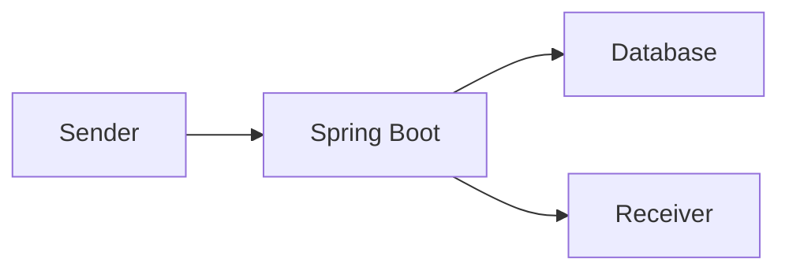

---

# 🎨 User Experience Principles

SoulSync AI is designed around five core principles:

- ❤️ Simplicity
- 🤖 Intelligence
- 🔐 Security
- ⚡ Performance
- 🌍 Accessibility

Every feature is built with these principles in mind, ensuring a modern, reliable and enjoyable experience for users.

---

<div align="center">


### ⚙️ Project Architecture & Installation →

</div>

# ⚙️ Project Architecture

SoulSync AI follows a modern full-stack architecture based on a clear separation of concerns. The frontend, backend, AI services and cloud infrastructure work together to deliver a secure, scalable and intelligent matchmaking platform.

---

# 🏛 Overall System Architecture

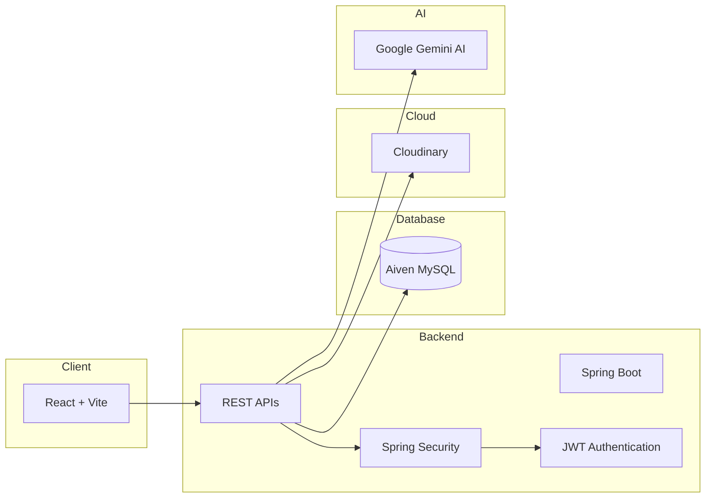

---

# 🗂 Project Structure

```text
SoulSync-AI
│
├── frontend
│   ├── public
│   ├── src
│   │   ├── assets
│   │   ├── components
│   │   ├── context
│   │   ├── hooks
│   │   ├── layouts
│   │   ├── pages
│   │   ├── routes
│   │   ├── services
│   │   ├── utils
│   │   └── App.jsx
│   │
│   └── package.json
│
├── backend
│   ├── config
│   ├── controller
│   ├── dto
│   ├── entity
│   ├── exception
│   ├── repository
│   ├── security
│   ├── service
│   ├── util
│   └── SoulSyncApplication.java
│
└── README.md
```

---

# 🏗 Backend Architecture

SoulSync AI adopts a layered architecture to keep the application modular, maintainable and scalable.

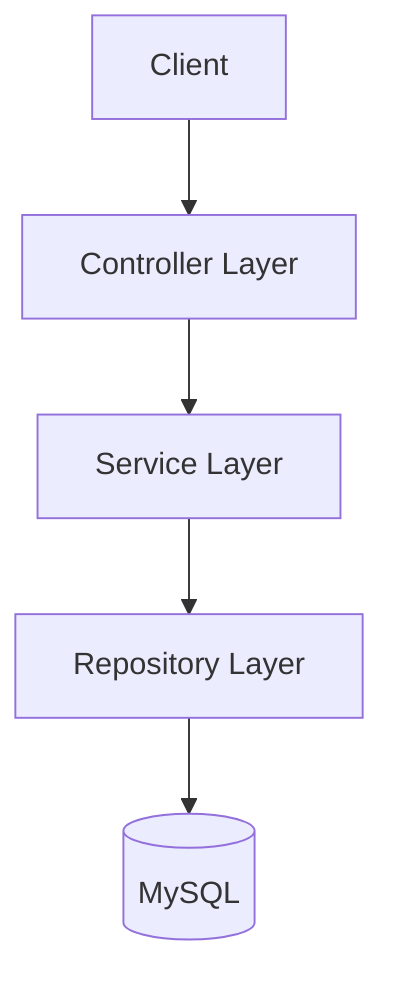

---

## 📂 Backend Layers

<div align="center">

| Layer | Responsibility |
|--------|----------------|
| Controller | Handles HTTP Requests |
| Service | Business Logic |
| Repository | Database Operations |
| Entity | Database Models |
| DTO | Data Transfer Objects |
| Config | Application Configuration |
| Security | JWT & Spring Security |
| Utility | Helper Functions |

</div>

---

# 🌐 REST API Flow

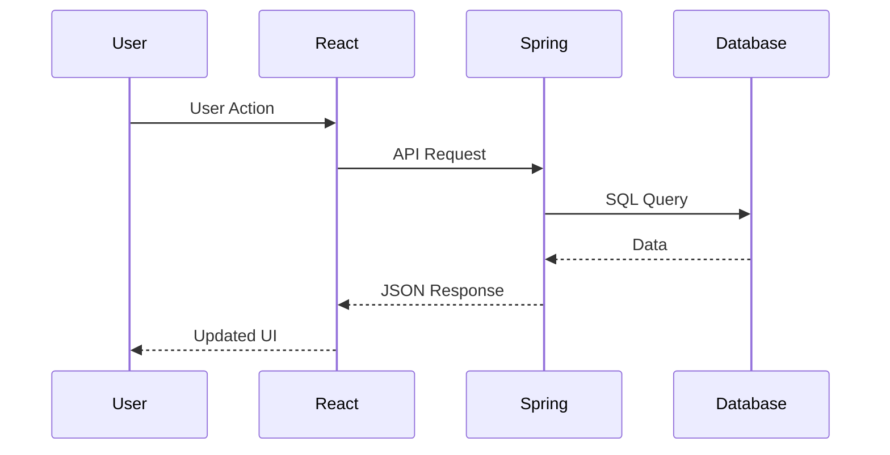

---

# 🗄 Database Design

SoulSync AI stores structured user information while maintaining normalized relationships between different modules.

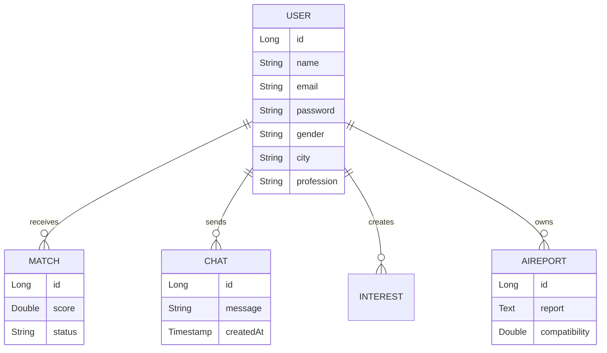

---

# 🧩 Major Modules

<div align="center">

| Module | Purpose |
|---------|---------|
| 👤 Authentication | Secure Login & Registration |
| ❤️ Matchmaking | AI Based Recommendations |
| 🤖 Gemini Integration | AI Compatibility Reports |
| 💬 Messaging | User Communication |
| 📷 Media | Cloudinary Image Upload |
| 👤 User Profile | Profile Management |
| 📊 Dashboard | Personalized Experience |

</div>

---

# 🔐 Authentication Workflow

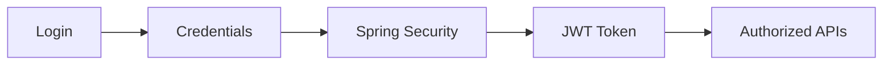

---

# 🔑 JWT Security

Every authenticated request follows the workflow below.

```text
User Login
      │
      ▼

Username + Password
      │
      ▼

Spring Security
      │
      ▼

JWT Token Generated
      │
      ▼

Stored in Client
      │
      ▼

Sent with Every API Request
      │
      ▼

Backend Validation
      │
      ▼

Authorized Response
```

---

# ☁ Cloudinary Integration

Cloudinary is responsible for storing all uploaded profile images securely in the cloud.

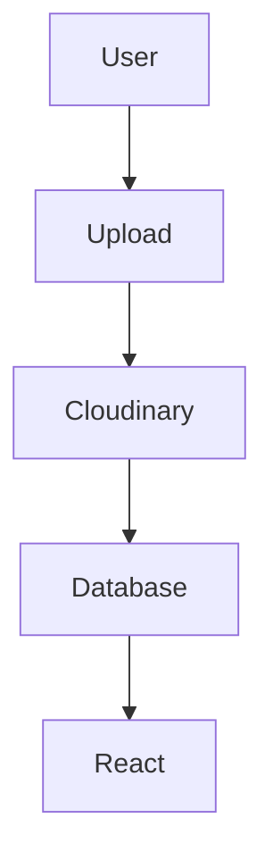

---

# 🤖 Google Gemini AI Integration

The AI engine communicates directly with Google's Gemini API whenever compatibility reports or relationship advice are requested.

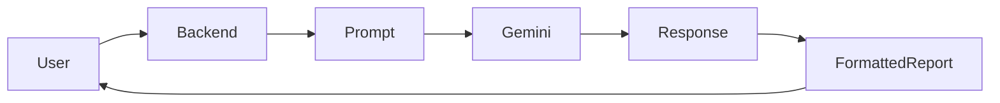

---

# 📡 API Modules

<div align="center">

| API Category | Description |
|--------------|-------------|
| 🔐 Authentication APIs | Login, Register |
| 👤 User APIs | Profile Management |
| ❤️ Match APIs | Recommendation Engine |
| 🤖 AI APIs | Gemini Integration |
| 💬 Chat APIs | Messaging System |
| 📷 Upload APIs | Cloudinary |
| 📊 Dashboard APIs | Personalized Data |

</div>

---

# 🚀 Getting Started

Clone the repository:

```bash
git clone https://github.com/TheKanishkDev/SoulSync-AI.git
```

Move into the project:

```bash
cd SoulSync-AI
```

---

# 📦 Backend Installation

```bash
cd backend

mvn clean install

mvn spring-boot:run
```

---

# 💻 Frontend Installation

```bash
cd frontend

npm install

npm run dev
```

---

# 🌍 Local Development

Once both services are running:

| Service | URL |
|----------|-----|
| Frontend | http://localhost:5173 |
| Backend | http://localhost:8080 |

---

<div align="center">


### 🔐 Configuration, Deployment & Security →

</div>
# 🔐 Configuration & Environment

SoulSync AI is designed with environment-based configuration, ensuring that sensitive credentials remain secure and are never hardcoded into the source code.

---

# ⚙ Environment Variables

The following environment variables are required to run the project locally.

## 🖥 Backend (.env / application.properties)

```properties
# ==============================
# Database Configuration
# ==============================

SPRING_DATASOURCE_URL=your_database_url
SPRING_DATASOURCE_USERNAME=your_username
SPRING_DATASOURCE_PASSWORD=your_password

# ==============================
# JWT Configuration
# ==============================

JWT_SECRET=your_super_secret_key
JWT_EXPIRATION=86400000

# ==============================
# Gemini AI
# ==============================

GEMINI_API_KEY=your_gemini_api_key

# ==============================
# Cloudinary
# ==============================

CLOUDINARY_CLOUD_NAME=your_cloud_name
CLOUDINARY_API_KEY=your_api_key
CLOUDINARY_API_SECRET=your_api_secret

# ==============================
# Server
# ==============================

SERVER_PORT=8080
```

---

## 💻 Frontend (.env)

```env
VITE_API_BASE_URL=http://localhost:8080
```

---

# 🚀 Production Deployment

SoulSync AI is deployed using a cloud-native architecture, enabling scalability, reliability and seamless updates.

<div align="center">

| Layer | Platform |
|--------|----------|
| 🌐 Frontend | Vercel |
| ⚙ Backend | Render |
| 🗄 Database | Aiven MySQL |
| ☁ Image Storage | Cloudinary |
| 🤖 AI Engine | Google Gemini |

</div>

---

# 🌍 Deployment Architecture

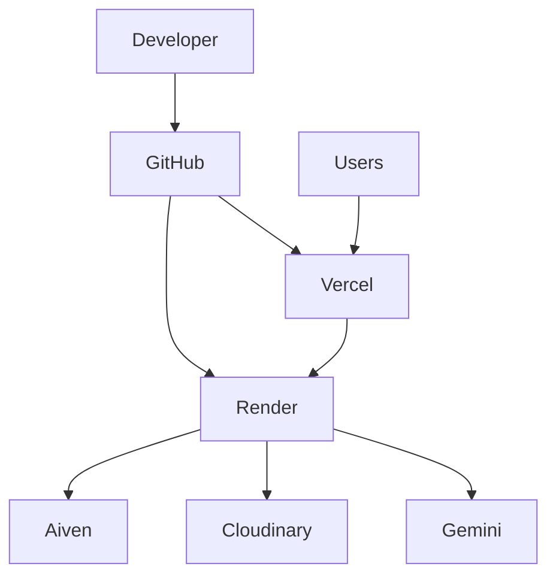

---

# 🚀 Deployment Workflow

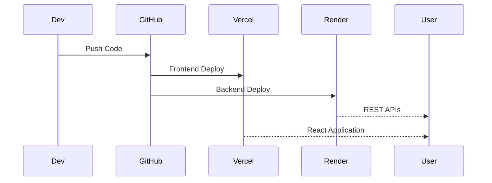

---

# ☁ Cloud Infrastructure

<div align="center">

| Service | Responsibility |
|----------|----------------|
| 🌐 Vercel | React Frontend Hosting |
| ⚙ Render | Spring Boot Backend |
| 🗄 Aiven | Managed MySQL Database |
| ☁ Cloudinary | Image Storage |
| 🤖 Gemini AI | Artificial Intelligence |

</div>

---

# 🔐 Security Architecture

Security is one of the core pillars of SoulSync AI. Every layer of the application has been designed with industry-standard security practices.

---

## 🛡 Security Features

<div align="center">

| Feature | Status |
|----------|--------|
| JWT Authentication | ✅ |
| Password Encryption | ✅ |
| Spring Security | ✅ |
| Protected REST APIs | ✅ |
| Secure Database Access | ✅ |
| Environment Variables | ✅ |
| Cloud Image Storage | ✅ |
| Authentication Filters | ✅ |

</div>

---

# 🔑 Authentication Lifecycle

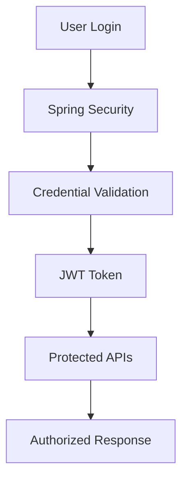

---

# 🔒 Password Security

Passwords are **never stored in plain text**.

Authentication follows this process:

```text
User Password
       │
       ▼

Password Encoder (BCrypt)
       │
       ▼

Encrypted Hash
       │
       ▼

Stored in Database
```

---

# 🧩 API Security

Every protected endpoint validates the JWT token before processing requests.

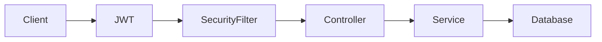

---

# 📊 Performance Optimizations

SoulSync AI has been optimized for responsiveness and production-grade performance.

---

## ⚡ Optimization Techniques

<div align="center">

| Optimization | Benefit |
|--------------|---------|
| React Component Reuse | Faster UI Rendering |
| Lazy Loading | Reduced Initial Load |
| REST API Architecture | Lightweight Communication |
| Database Normalization | Faster Queries |
| Cloudinary CDN | Optimized Image Delivery |
| JWT Authentication | Stateless Sessions |
| Vite Bundler | Extremely Fast Development |

</div>

---

# 📈 Performance Goals

| Metric | Target |
|---------|--------|
| Initial Load Time | < 2 Seconds |
| API Response Time | < 300 ms |
| AI Report Generation | 3–8 Seconds |
| Authentication | < 500 ms |
| Image Upload | Optimized via Cloudinary |

---

# 📦 Scalability

SoulSync AI has been architected with scalability in mind.

The application can easily support:

- 👥 Thousands of registered users
- ❤️ Large matchmaking datasets
- 📊 AI-generated compatibility reports
- ☁ Cloud-based media storage
- 🚀 Independent frontend/backend scaling
- 🔄 Future microservice migration

---

# 📁 Technology Stack

<div align="center">

| Category | Technologies |
|-----------|--------------|
| Frontend | React, Vite |
| Backend | Java, Spring Boot |
| Security | Spring Security, JWT |
| AI | Google Gemini AI |
| Database | MySQL (Aiven) |
| Cloud Storage | Cloudinary |
| Hosting | Vercel, Render |
| Version Control | Git & GitHub |

</div>

---

# 📚 Key Dependencies

### Backend

- Spring Boot
- Spring Web
- Spring Security
- Spring Data JPA
- MySQL Connector
- JWT
- Lombok
- Cloudinary SDK

### Frontend

- React
- React Router
- Axios
- Tailwind CSS (if applicable)
- Vite

---

# 🧪 Testing Checklist

| Module | Status |
|---------|--------|
| User Registration | ✅ |
| Login | ✅ |
| JWT Authentication | ✅ |
| Profile Management | ✅ |
| AI Compatibility Reports | ✅ |
| AI Advisor | ✅ |
| Match Recommendation | ✅ |
| Image Upload | ✅ |
| Deployment | ✅ |

---

<div align="center">


### 📈 Performance, Features & Roadmap →

</div>
# 📈 Performance & Feature Deep Dive

SoulSync AI is engineered not only to provide intelligent matchmaking but also to deliver a fast, secure and scalable user experience. Every module has been optimized to ensure smooth navigation, responsive interactions and efficient backend processing.

---

# ⚡ Performance Highlights

<div align="center">

| Category | Optimization |
|----------|--------------|
| ⚛ Frontend | React Component Reusability |
| ⚡ Bundler | Vite Hot Module Replacement |
| 🌐 APIs | Lightweight REST Architecture |
| 🗄 Database | Indexed MySQL Queries |
| ☁ Images | Cloudinary CDN |
| 🔐 Security | Stateless JWT Authentication |
| 🤖 AI | Optimized Prompt Engineering |

</div>

---

# 📊 System Performance Overview

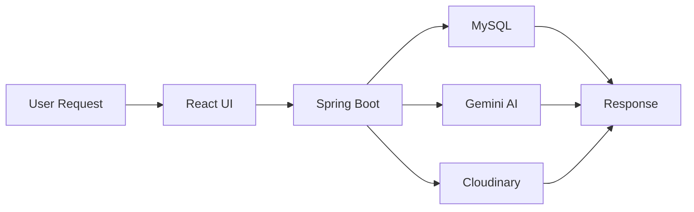

---

# 🚀 Application Modules

## 👤 User Module

Responsible for user onboarding and account management.

### Features

- User Registration
- Secure Login
- Profile Editing
- Profile Picture Upload
- Password Encryption
- JWT Authentication

---

## ❤️ Matchmaking Module

This module intelligently recommends compatible matches using AI-assisted analysis.

### Features

- Smart Recommendations
- Compatibility Evaluation
- Profile Ranking
- Personalized Suggestions
- AI-Based Decision Support

---

## 🤖 Artificial Intelligence Module

Google Gemini powers the intelligent capabilities of SoulSync AI.

### Features

- AI Compatibility Reports
- Relationship Advisor
- Prompt Engineering
- Personalized Suggestions
- Natural Language Analysis

---

## 💬 Communication Module

Allows users to interact in real-time after mutual matching.

### Features

- Secure Messaging
- Persistent Conversations
- Responsive Chat Interface
- User-to-User Communication

---

## ☁ Cloud Module

Handles cloud storage and deployment.

### Features

- Cloudinary Uploads
- Render Backend
- Vercel Frontend
- Aiven Database

---

# 📋 Feature Comparison

<div align="center">

| Capability | Traditional Matrimonial Apps | SoulSync AI |
|-------------|-----------------------------|-------------|
| Profile Search | ✅ | ✅ |
| Filters | ✅ | ✅ |
| AI Compatibility | ❌ | ✅ |
| AI Relationship Advisor | ❌ | ✅ |
| Personalized Reports | ❌ | ✅ |
| Real-Time Chat | Limited | ✅ |
| Cloud Infrastructure | Varies | ✅ |
| Modern UI | Limited | ✅ |

</div>

---

# 🧠 AI Decision Pipeline

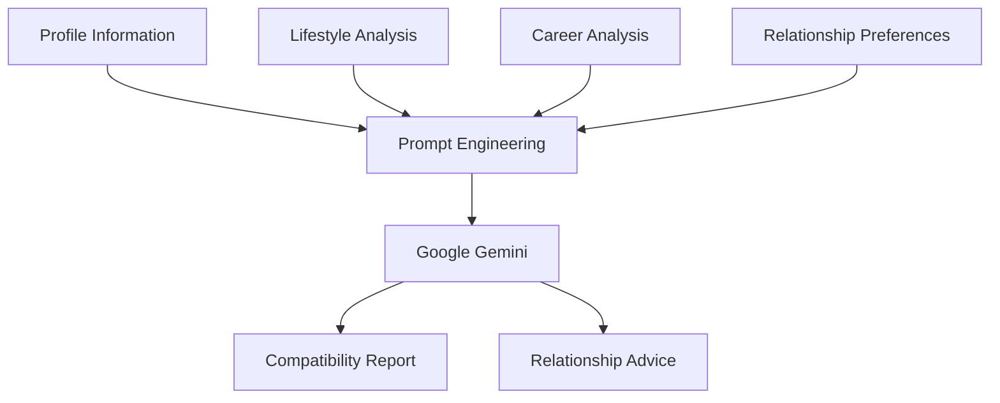

---

# 📸 Complete Application Walkthrough

## 🌍 Landing Page

- Modern Hero Section
- Feature Highlights
- AI Branding
- Responsive Navigation

---

## 🔐 Authentication

- Registration
- Login
- JWT Authentication
- Spring Security

---

## 👤 User Dashboard

- Personalized Dashboard
- AI Features
- Match Recommendations
- User Statistics

---

## ❤️ Match Discovery

- Intelligent Recommendations
- Compatibility Score
- Detailed Profiles

---

## 📊 Compatibility Report

- AI Generated Analysis
- Relationship Strengths
- Weakness Detection
- Improvement Suggestions

---

## 🤖 AI Advisor

- Natural Conversation
- Personalized Guidance
- Relationship Coaching

---

## 💬 Messaging

- Instant Chat
- Secure Conversations
- Responsive Interface

---

# 🎯 Real World Use Cases

### 👩 Finding Compatible Matches

AI evaluates user preferences and suggests highly compatible partners.

---

### 💬 Relationship Guidance

Users can ask Gemini relationship-related questions before making important decisions.

---

### 📊 Compatibility Evaluation

AI explains not just *whether* two users are compatible, but also *why*.

---

### ❤️ Better Matchmaking

Recommendations are based on multiple compatibility factors rather than only demographic filters.

---

# 🏆 Key Achievements

<div align="center">

| Achievement | Description |
|-------------|-------------|
| 🤖 AI Powered Platform | Google Gemini Integration |
| ☁ Cloud Native | Fully Hosted Infrastructure |
| 🔐 Secure Authentication | JWT + Spring Security |
| ❤️ Smart Matchmaking | AI Recommendations |
| 📊 Intelligent Reports | Personalized Compatibility Analysis |
| 💬 Communication | Real-Time Chat |
| 📷 Cloud Storage | Cloudinary |
| 📱 Responsive Design | Mobile Friendly |

</div>

---

# 📈 Future Enhancements

SoulSync AI has been designed to support future expansion with additional AI-powered capabilities.

## Planned Features

- 🎥 Video Calling Between Matched Users
- 🔔 Real-Time Notifications
- 🌍 Multi-Language Support
- 📱 Native Android Application
- 🍎 Native iOS Application
- 🤖 AI Voice Assistant
- 🎙 Voice Notes
- 🎥 AI Profile Introduction Videos
- 📅 Meeting Scheduler
- 📍 Nearby Match Discovery
- 🧬 Personality Prediction Models
- 😊 Emotion Detection
- 💍 Wedding Planning Assistance
- 🧾 Digital Marriage Documentation
- 📊 Advanced Analytics Dashboard

---

# 🛣 Product Roadmap

```mermaid
timeline

title SoulSync AI Roadmap

2026 Q1
: Authentication

: Dashboard

: Matchmaking

2026 Q2
: Gemini AI

: AI Reports

: AI Advisor

2026 Q3
: Real-Time Chat

: Cloud Deployment

: Performance Improvements

2026 Q4
: Video Calling

: Notifications

: Mobile Apps

2027
: AI Voice Assistant

: Emotion Recognition

: Predictive Matchmaking
```

---

# 🌟 Why Recruiters Love This Project

This project demonstrates practical experience with modern software engineering concepts:

- Java & Spring Boot Backend Development
- RESTful API Design
- Spring Security & JWT Authentication
- Cloud Deployment (Render & Vercel)
- MySQL Database Design
- Google Gemini AI Integration
- Full-Stack React Development
- Responsive UI Design
- Cloudinary Media Management
- Production-Level Project Architecture

---

# 📊 Repository Insights

<div align="center">

| Metric | Value |
|---------|-------|
| 💻 Architecture | Full Stack |
| 🧠 AI Integration | Google Gemini |
| ☁ Cloud Deployment | Production Ready |
| 🔐 Security | Enterprise Practices |
| 📱 Responsive | Fully Supported |
| 🚀 Scalability | High |

</div>

---

<div align="center">


### 👨‍💻 Open Source, Contributions & Credits →

</div>
# 🤝 Contributing

First of all, thank you for considering contributing to **SoulSync AI**.

Whether you're fixing a bug, improving documentation, suggesting new features, or optimizing performance, every contribution is appreciated and helps make the platform better for everyone.

---

# 🌟 Ways to Contribute

<div align="center">

| Contribution Type | Welcome |
|-------------------|----------|
| 🐞 Bug Reports | ✅ |
| ✨ Feature Requests | ✅ |
| 📖 Documentation | ✅ |
| 🎨 UI Improvements | ✅ |
| ⚡ Performance Optimizations | ✅ |
| 🤖 AI Enhancements | ✅ |
| 🔐 Security Improvements | ✅ |
| 🧪 Testing | ✅ |
| 🌍 Accessibility | ✅ |

</div>

---

# 🚀 Contribution Workflow

```mermaid
flowchart LR

A[Fork Repository]

B[Clone Repository]

C[Create Feature Branch]

D[Develop Changes]

E[Test Changes]

F[Commit Changes]

G[Push Branch]

H[Create Pull Request]

I[Review]

J[Merged 🎉]

A --> B

B --> C

C --> D

D --> E

E --> F

F --> G

G --> H

H --> I

I --> J
```

---

# 💻 Local Development

Clone the repository

```bash
git clone https://github.com/TheKanishkDev/SoulSync-AI.git
```

Create a feature branch

```bash
git checkout -b feature/your-feature-name
```

Make your changes and commit them

```bash
git commit -m "Add your meaningful commit message"
```

Push your branch

```bash
git push origin feature/your-feature-name
```

Finally, create a Pull Request 🚀

---

# 📜 Commit Message Guidelines

| Prefix | Purpose |
|---------|---------|
| ✨ feat | New Feature |
| 🐛 fix | Bug Fix |
| ♻ refactor | Code Refactoring |
| 📖 docs | Documentation |
| 🎨 style | UI Improvements |
| ⚡ perf | Performance |
| ✅ test | Testing |
| 🔥 remove | Remove Code |

---

# 🧪 Development Checklist

Before submitting a Pull Request, make sure:

- ✅ Code builds successfully
- ✅ No unnecessary files are committed
- ✅ All APIs work correctly
- ✅ No secrets or API keys are exposed
- ✅ Code follows project structure
- ✅ Documentation is updated if required
- ✅ UI remains responsive
- ✅ Existing functionality is not broken

---

# 📊 Project Statistics

<div align="center">

| Category | Details |
|-----------|---------|
| 💻 Project Type | Full Stack AI Web Application |
| 🧠 Artificial Intelligence | Google Gemini |
| ⚙ Backend | Java + Spring Boot |
| 🌐 Frontend | React + Vite |
| 🗄 Database | MySQL |
| ☁ Deployment | Vercel + Render |
| 📷 Media Storage | Cloudinary |
| 🔐 Authentication | JWT + Spring Security |

</div>

---

# 🏅 Engineering Highlights

SoulSync AI demonstrates practical implementation of modern software engineering principles:

- RESTful API Development
- Layered Architecture
- JWT Authentication
- Spring Security
- AI Prompt Engineering
- Cloud Deployment
- Database Design
- Responsive UI Development
- Full Stack Integration
- Production Ready Infrastructure

---

# 📂 Repository Overview

```text
📦 SoulSync AI
 ├── 🌐 React Frontend
 ├── ⚙ Spring Boot Backend
 ├── 🤖 Gemini AI Integration
 ├── 🗄 MySQL Database
 ├── ☁ Cloudinary Storage
 ├── 🔐 JWT Security
 ├── ❤️ Match Recommendation Engine
 ├── 📊 AI Compatibility Reports
 ├── 💬 AI Relationship Advisor
 └── 🚀 Production Deployment
```

---

# 🌍 Browser Compatibility

<div align="center">

| Browser | Supported |
|----------|-----------|
| Google Chrome | ✅ |
| Microsoft Edge | ✅ |
| Mozilla Firefox | ✅ |
| Safari | ✅ |
| Brave | ✅ |
| Opera | ✅ |

</div>

---

# 📱 Device Compatibility

<div align="center">

| Device | Status |
|---------|--------|
| 💻 Desktop | ✅ |
| 💼 Laptop | ✅ |
| 📱 Android | ✅ |
| 🍎 iPhone | ✅ |
| 📟 Tablet | ✅ |

</div>

---

# 🔒 Privacy & Security

Your privacy is important.

SoulSync AI is designed with secure authentication, encrypted password storage, protected APIs and cloud-based infrastructure to ensure user information remains secure.

Key practices include:

- BCrypt password hashing
- JWT-based authorization
- Environment variable configuration
- Secure media uploads
- Protected backend routes
- Database validation

---

# 📚 Learning Outcomes

This project showcases experience in:

<div align="center">

| Domain | Skills Demonstrated |
|--------|---------------------|
| Backend | Java, Spring Boot, REST APIs |
| Security | Spring Security, JWT |
| Database | MySQL, JPA |
| Frontend | React, Vite |
| AI | Google Gemini Integration |
| Cloud | Render, Vercel, Cloudinary |
| DevOps | Deployment & Configuration |
| Software Engineering | Layered Architecture |

</div>

---

# 👨‍💻 Developer

<div align="center">

## Kanishka Gupta

**Full Stack Java Developer • AI Enthusiast • Problem Solver**

Passionate about building scalable applications powered by Artificial Intelligence while creating meaningful user experiences through clean architecture and modern technologies.

</div>

---

# 📫 Connect With Me

<div align="center">

<a href="https://github.com/TheKanishkDev">

</a>

&nbsp;

<a href="https://www.linkedin.com/in/kanishk-gupta/">

</a>

&nbsp;

<a href="mailto:your-email@example.com">

</a>

</div>

> **Replace the email link above with your actual email address.**

---

# ⭐ Support the Project

If you found this project useful or inspiring:

🌟 Star the repository

🍴 Fork the repository

🛠 Contribute improvements

💬 Share feedback

❤️ Spread the word

---

# 🙏 Acknowledgements

Special thanks to the amazing open-source community and the technologies that made this project possible.

- Java
- Spring Boot
- React
- Vite
- Google Gemini AI
- MySQL
- Cloudinary
- Render
- Vercel
- GitHub

---

# 📄 License

This project is licensed under the **MIT License**.

Feel free to use, modify and contribute in accordance with the license terms.

---

<div align="center">

## ⭐ If you like SoulSync AI, don't forget to leave a star!


</div>
