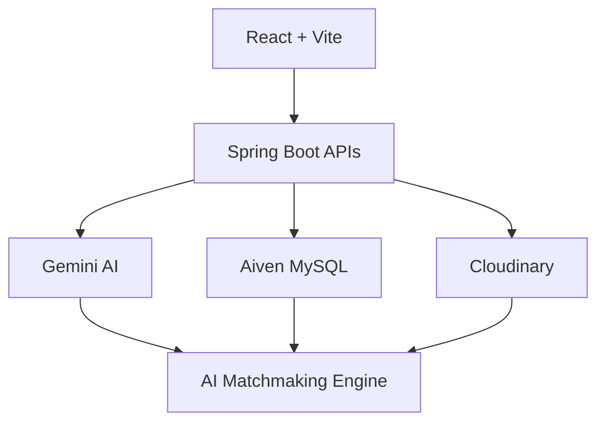
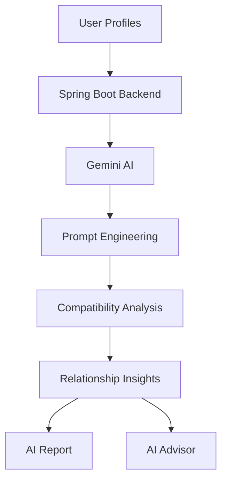
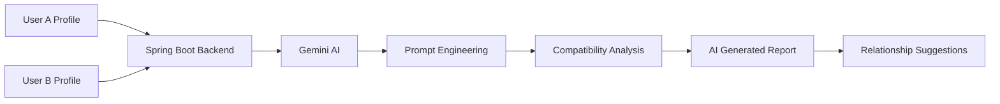
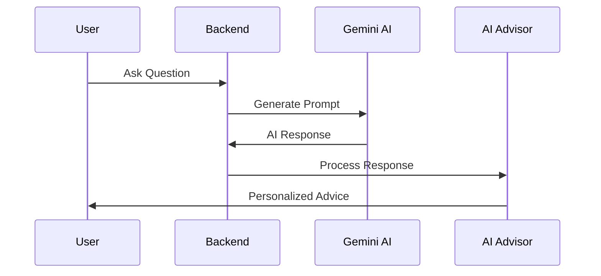

<div align="center">

# 💖 SoulSync AI


<br>

<p align="center">


</p>

<br>

<a href="https://soul-sync-ai-ten.vercel.app">

</a>

&nbsp;&nbsp;

<a href="https://github.com/TheKanishkDev/SoulSync-AI">

</a>

</div>

---

# 🌸 Welcome to SoulSync AI

> **SoulSync AI** is a next-generation AI-powered matrimonial platform designed to transform traditional matchmaking into a personalized, intelligent and meaningful experience.

Instead of relying only on static profile filters, SoulSync AI leverages **Google Gemini AI** to analyze compatibility, generate relationship insights and recommend meaningful matches based on multiple real-world compatibility factors.

The platform enables users to:

- ❤️ Discover compatible matches
- 🤖 Generate AI compatibility reports
- 💬 Talk with an AI relationship advisor
- 📊 Receive personalized recommendations
- 🔐 Enjoy secure authentication
- ☁️ Store images securely using Cloudinary
- ⚡ Experience blazing fast React + Spring Boot architecture

---

# ✨ Project Highlights

| Feature | Description |
|---------|-------------|
| 🤖 AI Powered | Google Gemini AI analyzes compatibility |
| ❤️ Smart Matchmaking | Personalized recommendations |
| 💬 AI Advisor | Relationship guidance before marriage |
| 📊 AI Reports | Detailed compatibility reports |
| ☁️ Cloud Ready | Render + Vercel + Aiven + Cloudinary |
| 🔐 Secure | JWT Authentication |
| ⚡ Modern | React 19 + Spring Boot 3 |

---

# 🚀 Live Links

| Platform | URL |
|----------|-----|
| 🌐 Frontend | https://soul-sync-ai-ten.vercel.app |
| ⚙ Backend | https://soulsync-ai-8hyt.onrender.com |

---

# 🛠 Technology Stack

<div align="center">


<br><br>


</div>

---

# 📑 Table of Contents

- 🌸 About SoulSync AI
- 📸 Application Preview
- ✨ Core Features
- 🤖 Artificial Intelligence
- ❤️ Match Recommendation Engine
- 📊 AI Compatibility Reports
- 💬 AI Relationship Advisor
- 💻 Tech Stack
- 🏗 Architecture
- 📂 Project Structure
- ⚙ Installation
- 🔐 Environment Variables
- 🚀 Deployment
- 🔮 Future Enhancements
- 🤝 Contributing
- 👨‍💻 Developer

---

# 🌟 Why SoulSync AI?

Traditional matrimonial websites mostly rely on static profile filtering and manual decision making.

SoulSync AI introduces a modern **AI-first approach**, helping users understand **relationship compatibility before taking the next step**.

<div align="center">

| Traditional Platforms | SoulSync AI |
|----------------------|-------------|
| Static Biodata | 🤖 AI Compatibility Analysis |
| Manual Filtering | 🧠 Smart Recommendations |
| No Guidance | ❤️ AI Relationship Advisor |
| Basic Matching | 📊 AI Compatibility Reports |
| Guess Based Decisions | 🎯 AI Assisted Decision Making |

</div>

---

# 🏗 System Architecture



---
<div align="center">

## 🌍 Experience SoulSync AI

> **Every screen has been designed to make matchmaking intelligent, secure and meaningful.**

</div>

---

# 🏠 Landing Experience

<p align="center">

</p>

### ✨ Highlights

- Beautiful responsive UI
- AI-first design philosophy
- Smooth navigation
- Modern landing experience
- Quick access to authentication
- Elegant visual identity

---

# 🔐 Secure Authentication

<div align="center">

### Login


</div>

### Authentication Features

| Feature | Description |
|---------|-------------|
| 🔐 JWT Authentication | Secure login sessions |
| 🔒 Password Protection | Encrypted credentials |
| ☁ Cloud Hosted | Production-ready authentication |
| ⚡ Fast Login | Optimized backend APIs |

---

# 📝 User Registration

<div align="center">

### Registration Step 1


<br><br>

### Registration Step 2


</div>

---

# ✨ Core Features

<div align="center">

| 👤 User Management | ❤️ Matchmaking | 🤖 Artificial Intelligence | ☁ Cloud |
|:-----------------:|:-------------:|:--------------------------:|:--------:|
| Secure Registration | Smart Recommendations | Gemini AI Advisor | Cloudinary |
| JWT Authentication | Compatibility Ranking | AI Reports | Aiven MySQL |
| Profile Management | Interest Requests | Relationship Guidance | Render |
| Dashboard | Personalized Matching | Conversation Suggestions | Vercel |

</div>

---

# 👤 User Management

### Everything required for a secure matrimonial platform.

✅ Secure Registration

✅ JWT Authentication

✅ Personalized Profiles

✅ Profile Editing

✅ Cloudinary Image Upload

✅ Responsive Dashboard

---

# ❤️ AI Match Recommendation Engine

<div align="center">


</div>

Instead of relying on simple profile filters, **SoulSync AI intelligently ranks users based on multiple real-world compatibility factors.**

---

## 🧠 Compatibility Factors

| Category | AI Evaluation |
|-----------|--------------|
| 📍 Location | ✔ |
| 🎓 Education | ✔ |
| 💼 Profession | ✔ |
| ❤️ Lifestyle | ✔ |
| 🚭 Smoking & Drinking | ✔ |
| 👨‍👩‍👧 Family Preferences | ✔ |
| 🛕 Religion | ✔ |
| 👶 Children Plans | ✔ |
| 🎯 Future Goals | ✔ |
| 🤖 AI Compatibility Score | ✔ |

---

# 📊 Personalized Dashboard

<div align="center">


</div>

The dashboard acts as the central hub of the platform, providing users with everything needed to discover compatible matches and interact with AI-powered services.

---

### Dashboard Includes

- 🤖 AI Recommendations
- ❤️ Personalized Matches
- 💬 AI Advisor Access
- 📊 Compatibility Overview
- 👤 Profile Management
- 🔔 Notifications
- 💌 Interest Requests
- 💬 Conversations

---

# 👤 Detailed Match Profile

<div align="center">


</div>

Every recommended profile provides rich information so users can make informed relationship decisions.

---

## Available Information

| Personal | Lifestyle | Career | AI |
|----------|-----------|---------|----|
| Age | Lifestyle | Occupation | AI Report |
| Height | Bio | Income | AI Advisor |
| Religion | Habits | City | Compatibility |
| Community | Preferences | Education | Interest Request |

---

# ❤️ Matchmaking Workflow


---

# 🤖 Artificial Intelligence

SoulSync AI integrates **Google Gemini AI** to make matchmaking more meaningful than traditional matrimonial platforms.

Instead of merely showing profiles, the AI understands user information and generates compatibility insights that help users make informed decisions.

---

## AI Capabilities

| Capability | Description |
|------------|-------------|
| 🤖 AI Compatibility Reports | Relationship analysis |
| ❤️ Match Recommendation | Intelligent ranking |
| 💬 AI Relationship Advisor | Personalized guidance |
| 📊 Compatibility Score | AI-generated evaluation |
| 💡 Relationship Suggestions | Smart recommendations |
| 🎯 Conversation Topics | Ice breakers before marriage |

---

# ⚡ AI Workflow



---

<div align="center">

## 💡 "AI doesn't replace human decisions — it empowers them."

</div>

---
# 🤖 AI Compatibility Reports

<div align="center">


</div>

---

Unlike traditional matrimonial platforms, SoulSync AI doesn't stop at profile matching.

It leverages **Google Gemini AI** to deeply analyze user profiles and generate intelligent compatibility reports, helping users understand strengths, concerns, lifestyle alignment, and long-term relationship potential before making important decisions.

---

# 🧠 AI Compatibility Pipeline



---

# 📄 Compatibility Overview

<div align="center">


</div>

---

### 📊 Report Includes

| Feature | Description |
|----------|-------------|
| ❤️ Overall Compatibility Score | AI-generated compatibility percentage |
| 📝 AI Summary | Relationship overview |
| 🎯 Confidence Level | AI confidence score |
| 💚 Strengths | Positive compatibility factors |
| ⚠️ Concerns | Potential relationship challenges |
| 💬 Conversation Topics | Suggested discussion starters |
| 💡 Recommendations | Personalized advice |

---

# 📈 Detailed Compatibility Analysis

<div align="center">


</div>

---

Gemini AI evaluates multiple relationship dimensions instead of relying on simple profile filtering.

### AI Evaluation Categories

| Category | Analysis |
|-----------|----------|
| 📍 Location Compatibility | ✔ |
| 🌱 Lifestyle Compatibility | ✔ |
| 👨‍👩‍👧 Family Expectations | ✔ |
| 👶 Children Planning | ✔ |
| 💼 Career Alignment | ✔ |
| 💬 Communication Readiness | ✔ |
| ❤️ Relationship Stability | ✔ |
| 🎯 Long-Term Goals | ✔ |

---

# 💡 Personalized Recommendations

<div align="center">


</div>

---

The report concludes with practical recommendations that help users understand the relationship beyond numbers.

### Recommendation Summary

- ✅ Positive Compatibility Highlights
- ⚠️ Important Discussion Topics
- 💡 AI Relationship Suggestions
- ❤️ Long-Term Compatibility
- ❓ Questions Before Marriage
- 🎯 Overall Recommendation

---

# 💬 AI Relationship Advisor

<div align="center">


</div>

---

The built-in AI Relationship Advisor acts as a personalized assistant capable of answering profile-specific questions using Google Gemini AI.

Instead of generic chatbot responses, the AI understands both users' profiles and provides contextual relationship guidance.

---

## Example Questions

> ❤️ Is this profile suitable for me?

> 🤔 What concerns should I discuss before marriage?

> 💬 What should I ask on the first conversation?

> 🎯 Is this a good long-term match?

> 🤖 Which compatibility factors are strongest?

> ❤️ Are there any lifestyle conflicts?

---

# ⚡ AI Advisor Workflow



---

# 💬 Real-Time Personal Chat

<div align="center">


<br><br>


</div>

---

Once two users express mutual interest, SoulSync AI unlocks secure real-time messaging, allowing meaningful conversations without sharing personal phone numbers.

This communication layer enables privacy-first interaction while helping users know each other before taking the next step.

---

## Chat Features

| Feature | Available |
|----------|-----------|
| 💬 Instant Messaging | ✅ |
| 🔒 Secure Communication | ✅ |
| ⚡ WebSocket Powered | ✅ |
| ❤️ Mutual Match Required | ✅ |
| 📱 Responsive Chat UI | ✅ |
| ☁ Production Ready | ✅ |

---

# 🏗 Project Structure

```text
SoulSync-AI
│
├── Backend
│   ├── Controllers
│   ├── Services
│   ├── Repositories
│   ├── Models
│   ├── DTOs
│   ├── Configuration
│   ├── Security
│   └── AI Module
│
├── Frontend
│   ├── Components
│   ├── Pages
│   ├── Context
│   ├── Assets
│   ├── Hooks
│   └── Styles
│
└── README.md
```

---

# ⚙️ Local Installation

## 1️⃣ Clone Repository

```bash
git clone https://github.com/TheKanishkDev/SoulSync-AI.git
```

---

## 2️⃣ Frontend

```bash
cd Frontend

npm install

npm run dev
```

---

## 3️⃣ Backend

```bash
cd Backend

mvn spring-boot:run
```

---

# 🔐 Environment Variables

```properties

SPRING_DATASOURCE_URL=

SPRING_DATASOURCE_USERNAME=

SPRING_DATASOURCE_PASSWORD=

JWT_SECRET=

GEMINI_API_KEY=

CLOUDINARY_CLOUD_NAME=

CLOUDINARY_API_KEY=

CLOUDINARY_API_SECRET=

```

---

# ☁️ Deployment Stack

| Layer | Service |
|--------|----------|
| 🌐 Frontend | Vercel |
| ⚙ Backend | Render |
| 🗄 Database | Aiven MySQL |
| 📷 Image Storage | Cloudinary |
| 🤖 AI | Google Gemini |

---

<div align="center">

## 🚀 Production Ready Architecture

**React + Spring Boot + Gemini AI + Cloud Infrastructure**

</div>

---
# 🚀 Deployment

<div align="center">

| 🌐 Frontend | ⚙ Backend | 🗄 Database | 📷 Storage | 🤖 AI |
|:----------:|:---------:|:-----------:|:----------:|:------:|
| Vercel | Render | Aiven MySQL | Cloudinary | Google Gemini |

</div>

---

# 🔒 Security Features

<div align="center">

| Security Layer | Status |
|---------------|:------:|
| 🔐 JWT Authentication | ✅ |
| 🔑 Password Encryption | ✅ |
| 🌐 Protected REST APIs | ✅ |
| 📦 Environment Variables | ✅ |
| ☁ Secure Cloud Database | ✅ |
| 📷 Secure Image Upload | ✅ |
| 🛡 CORS Configuration | ✅ |
| ⚡ Secure Spring Security | ✅ |

</div>

---

# 📈 Performance

<div align="center">

| Feature | Benefit |
|----------|---------|
| ⚛ React 19 | Fast UI Rendering |
| ☕ Spring Boot 3 | High Performance Backend |
| 🚀 REST APIs | Low Response Time |
| 🗄 Aiven MySQL | Managed Cloud Database |
| ☁ Cloudinary CDN | Optimized Image Delivery |
| 🤖 Gemini AI | Intelligent Responses |
| 🌍 Render + Vercel | Global Deployment |

</div>

---

# 📊 Application Modules

## 👤 Authentication

- Secure Login
- User Registration
- JWT Authentication
- Session Management

---

## ❤️ User Profiles

- Personal Information
- Lifestyle Preferences
- Education
- Career
- Religion
- Community
- Family Preferences

---

## 🤖 Artificial Intelligence

- AI Compatibility Reports
- AI Relationship Advisor
- Personalized Suggestions
- Conversation Guidance

---

## 💬 Communication

- Interest Requests
- Real-Time Messaging
- Mutual Match Chat
- WebSocket Communication

---

## ☁ Cloud Services

- Cloudinary Image Storage
- Render Deployment
- Vercel Deployment
- Aiven MySQL

---

# 🔥 Key Highlights

<div align="center">

| ✔ | Feature |
|---|---------|
| 🤖 | Google Gemini AI Integration |
| ❤️ | AI Relationship Advisor |
| 📊 | Detailed Compatibility Reports |
| 🎯 | Smart Match Recommendation Engine |
| 🔐 | Secure JWT Authentication |
| ☁ | Cloud Hosted Infrastructure |
| 📷 | Cloudinary Image Upload |
| ⚡ | High Performance REST APIs |
| 📱 | Fully Responsive UI |
| 🚀 | Production Ready Deployment |

</div>

---

# 🔮 Future Roadmap

```text
✅ User Authentication

✅ Profile Management

✅ AI Match Recommendation

✅ AI Compatibility Reports

✅ AI Relationship Advisor

✅ Cloud Deployment

⬜ Voice AI Assistant

⬜ Video Calling

⬜ Push Notifications

⬜ Mobile Application

⬜ AI Relationship Analytics

⬜ Multi-language Support

⬜ Face Verification

⬜ Premium Membership

⬜ Admin Dashboard
```

---

# 📌 Why SoulSync AI?

Traditional matrimonial applications only help users **find profiles.**

SoulSync AI helps users **understand relationships.**

Instead of matching people using only age, city or religion, the platform leverages **Google Gemini AI** to generate compatibility insights, relationship guidance and personalized recommendations before users make life-changing decisions.

> **AI should not replace human decisions — it should help people make better ones.**

---

# 💻 Technology Ecosystem

<div align="center">


<br><br>


</div>

---

# 📂 Repository Structure

```text
SoulSync-AI

├── 📁 Backend
│      ├── Controllers
│      ├── Services
│      ├── Repositories
│      ├── Security
│      ├── Models
│      ├── DTOs
│      └── AI Module
│
├── 📁 Frontend
│      ├── Components
│      ├── Pages
│      ├── Assets
│      ├── Context
│      ├── Hooks
│      └── Styles
│
└── README.md
```

---

# 🤝 Contributing

Contributions are always welcome.

If you'd like to improve SoulSync AI:

```bash
1️⃣ Fork this repository

2️⃣ Create a new branch

3️⃣ Commit your changes

4️⃣ Push your branch

5️⃣ Open a Pull Request 🚀
```

---

# 👨‍💻 Developer

<div align="center">

## Kanishk Gupta

### Computer Science Engineer

Java • Spring Boot • React • REST APIs • MySQL • Gemini AI

<a href="https://github.com/TheKanishkDev">

</a>

</div>

---

# ⭐ Support

If you enjoyed exploring this project,

<div align="center">

## ⭐ Star this Repository

It motivates me to continue building impactful AI-powered applications.

<a href="https://github.com/TheKanishkDev/SoulSync-AI">


</a>

</div>

---

# 🙏 Acknowledgements

Special thanks to the open-source community and the amazing technologies powering this project.

- Java
- Spring Boot
- React
- Vite
- Google Gemini AI
- Cloudinary
- Render
- Vercel
- Aiven MySQL

---

<div align="center">


# 💖 SoulSync AI

### Intelligent Matchmaking Powered by Artificial Intelligence


### 🌟 Made with ❤️ by **Kanishka Gupta**

</div>

# 📸 Application Preview
