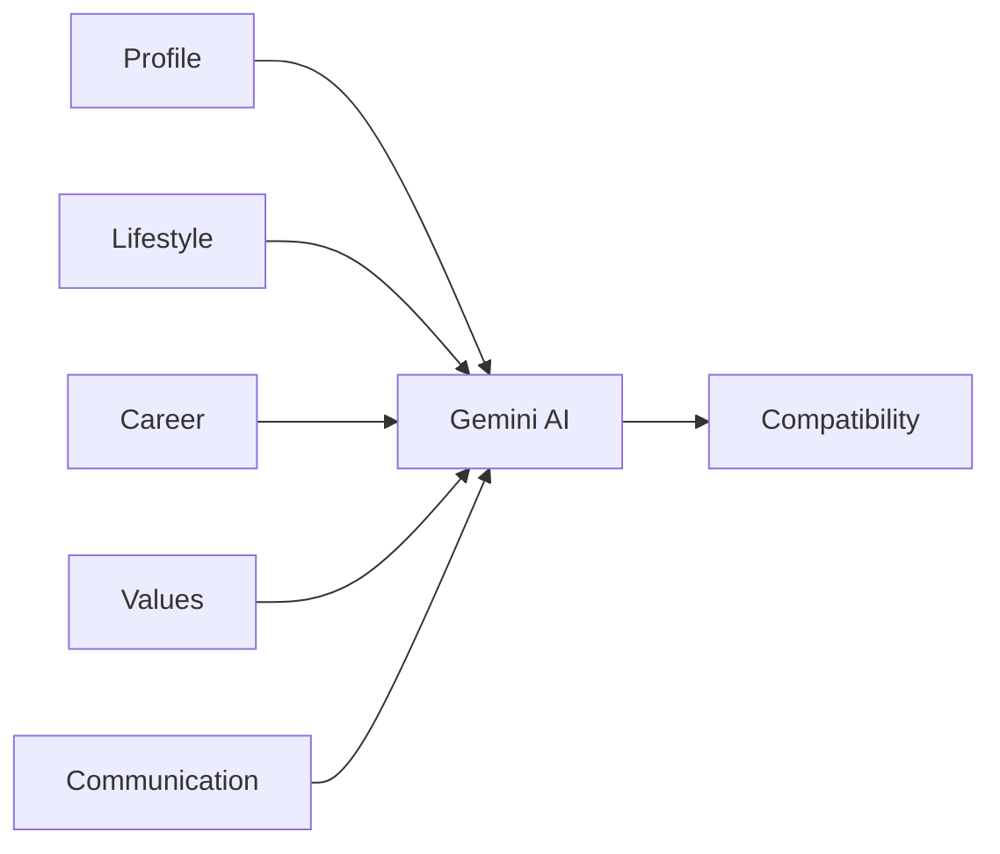
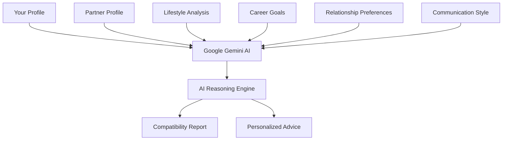
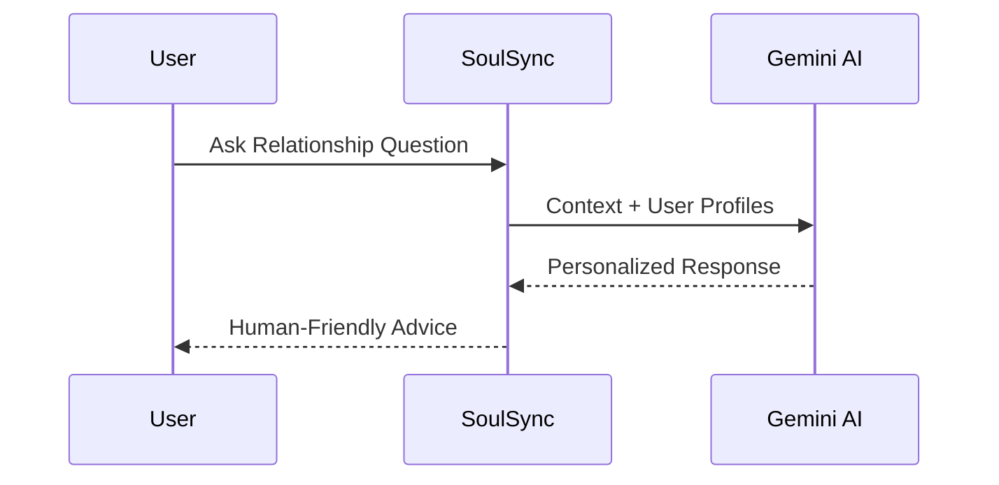
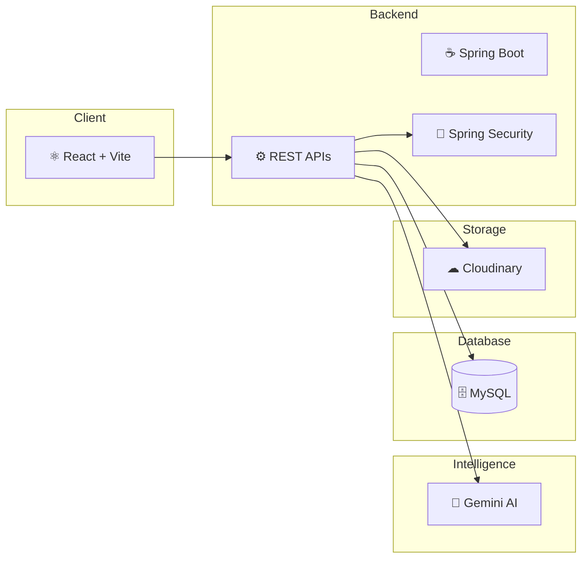
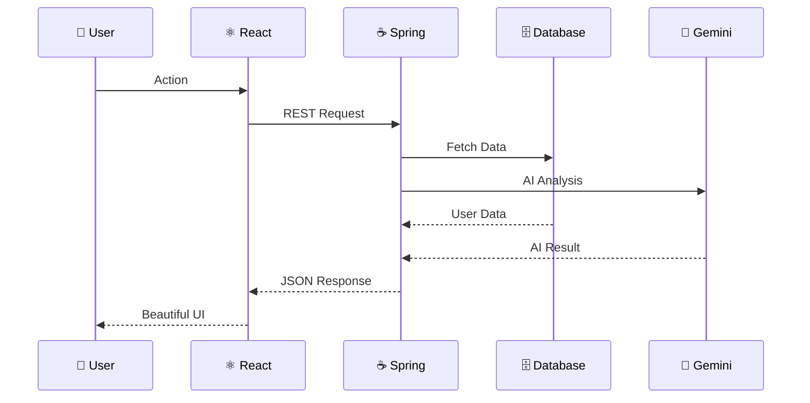
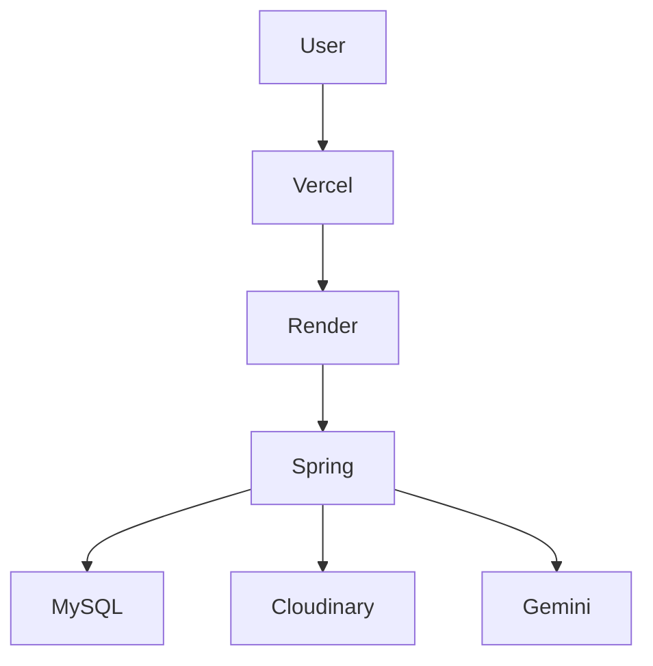
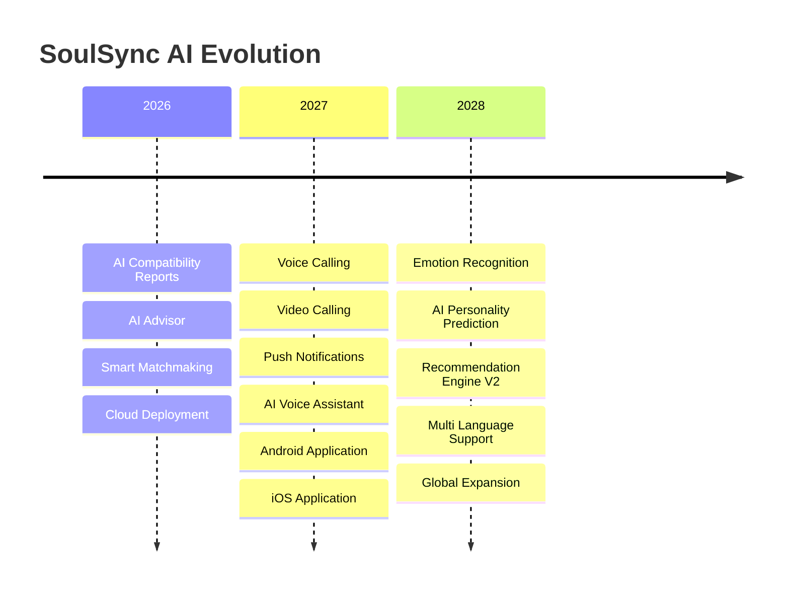

<div align="center">


<br>


<br><br>

<a href="https://soul-sync-ai-ten.vercel.app">

</a>

</div>

---

# ❤️ Finding the Right Person Shouldn't Feel Random.

Traditional matrimonial platforms stop at filters.

**SoulSync AI goes several steps further.**

Using **Artificial Intelligence**, it studies compatibility, relationship dynamics,
communication styles, shared values and long-term goals before recommending a match.

Instead of asking

> "Who matches my filters?"

SoulSync AI answers

> **"Who is actually compatible with me?"**

---

<div align="center">

# ✨ Built For The Modern Generation

</div>

<p align="center">


</p>

---

<div align="center">

## The Entire Journey

</div>

```text
Discover
    │
    ▼
Create Profile
    │
    ▼
AI Analysis
    │
    ▼
Compatibility Score
    │
    ▼
Detailed AI Report
    │
    ▼
Relationship Advice
    │
    ▼
Meaningful Conversation
```

---

# 🌟 Why SoulSync AI?

<div align="center">

| ❤️ Traditional Apps | 🤖 SoulSync AI |
|:-------------------:|:--------------:|
| Browse Profiles | AI understands compatibility |
| Basic Filters | Intelligent Match Ranking |
| Random Decisions | Data Driven Recommendations |
| Manual Analysis | AI Generated Reports |
| No Guidance | Relationship Advisor |
| Static Experience | Interactive AI Platform |

</div>

---

# 🧠 Meet Your AI Matchmaker

<p align="center">


</p>

Unlike ordinary matchmaking platforms,

SoulSync AI doesn't simply show profiles.

It explains:

✔ Why you're compatible

✔ Where conflicts may arise

✔ Communication strengths

✔ Shared values

✔ Long-term relationship outlook

✔ Personalized recommendations

---

# 🚀 One Platform.

### Everything You Need.

<div align="center">

| ❤️ Smart Matching | 🤖 AI Reports | 💬 AI Advisor |
|------------------|--------------|---------------|
| Intelligent recommendations | Compatibility analysis | Personalized relationship guidance |

| 📷 Cloud Storage | ⚡ Real-Time Chat | 🔐 Secure Authentication |
|-----------------|-----------------|-------------------------|
| Cloudinary | Instant messaging | JWT + Spring Security |

</div>

---

# 💎 Crafted With Modern Technologies

<p align="center">


</p>

<p align="center">


</p>

---

<div align="center">

## Scroll Down ↓

The product gets better.

</div>
---

<div align="center">

# ✨ Built Around Intelligence, Not Filters

### Every recommendation is generated with purpose.


</div>

<br>

<p align="center">


</p>

---

# ❤️ What Happens After You Sign Up?

Instead of immediately showing hundreds of random profiles...

SoulSync AI first understands **who you are.**

It analyzes your personality, preferences, career, lifestyle and future goals before recommending someone who actually fits your life.

```text
Create Account
      │
      ▼
Complete Profile
      │
      ▼
AI Studies Compatibility
      │
      ▼
Ranks Potential Matches
      │
      ▼
Generates Compatibility Insights
      │
      ▼
Meaningful Connections
```

---

<div align="center">

# 🌸 Designed To Understand People

</div>

<table>
<tr>

<td width="33%" align="center">

## ❤️ Lifestyle

Sleep Schedule

Food Preference

Smoking

Drinking

Fitness

Travel

</td>

<td width="33%" align="center">

## 💼 Career

Profession

Education

Income

Goals

Growth

Work-Life Balance

</td>

<td width="33%" align="center">

## 🌍 Values

Religion

Family

Children

Communication

Expectations

Marriage Goals

</td>

</tr>
</table>

---

<div align="center">

# 📸 Beautiful User Experience

</div>

<p align="center">


</p>

<p align="center">


</p>

---

# 🚀 More Than Just Registration

Every profile becomes the foundation for AI-powered decision making.

Instead of static biodata...

Your profile becomes a living representation of your lifestyle, ambitions and relationship expectations.

---

<div align="center">

# 🎯 AI Doesn't Guess.

## It Understands.

</div>



---

# 🌟 Core Experiences

<div align="center">

| Feature | Experience |
|:---------|:-----------|
| ❤️ Smart Matchmaking | AI ranks your most compatible matches |
| 🤖 Compatibility Engine | Understand strengths & challenges |
| 💬 AI Advisor | Ask relationship questions naturally |
| 📊 Personalized Reports | Deep compatibility analysis |
| 📷 Cloud Media | Secure profile image management |
| 🔐 Enterprise Security | JWT + Spring Security |
| ⚡ Real-Time Chat | Instant communication |
| ☁ Cloud Deployment | Always available |

</div>

---

<div align="center">

# 📈 Your Journey

</div>

```text
👤 Create Profile
        │
        ▼
🧠 AI Understands You
        │
        ▼
❤️ Finds Better Matches
        │
        ▼
📊 Explains Compatibility
        │
        ▼
💬 Helps You Communicate
        │
        ▼
🤝 Build Meaningful Relationships
```

---

<div align="center">

# 💬 Every Match Has A Story


</div>

Unlike traditional matrimonial websites that simply list profiles...

SoulSync AI tells you **why someone is recommended**, giving every match context and meaning.

---

<div align="center">

## ❤️ Because choosing a life partner deserves more than filters.

</div>

---

<div align="center">


### 🤖 Next Up → Meet the AI Brain Behind SoulSync AI

</div>
---

<div align="center">

# 🧠 Meet The Intelligence Behind SoulSync AI

### Not just Artificial Intelligence.

### **Relationship Intelligence.**


</div>

<br>

<p align="center">


</p>

---

# ❤️ Compatibility Isn't Just A Number.

Most platforms tell you

> **"92% Match."**

And that's it.

SoulSync AI believes people deserve **an explanation**, not just a score.

Instead of showing a meaningless percentage...

Gemini AI carefully studies both profiles and generates a complete compatibility report explaining:

- ❤️ Why you complement each other
- ⚠️ Potential relationship challenges
- 🌱 Areas where both people can grow
- 💬 Communication compatibility
- 👨‍👩‍👧 Family expectations
- 💼 Career alignment
- 🎯 Long-term relationship outlook

---

<div align="center">

# 🤖 How AI Thinks

</div>



---

<div align="center">

# 💎 AI Doesn't Replace Human Decisions

### It Makes Them Smarter.

</div>

SoulSync AI never decides **who you should marry.**

Instead...

It provides meaningful insights that help users make informed decisions with confidence.

Think of it as an intelligent companion rather than an automated decision-maker.

---

<div align="center">

# 📊 Inside Every AI Report

</div>

<table>

<tr>

<td align="center">

❤️

### Emotional Compatibility

</td>

<td align="center">

💬

### Communication Style

</td>

<td align="center">

🌍

### Shared Values

</td>

</tr>

<tr>

<td align="center">

👨‍👩‍👧

### Family Expectations

</td>

<td align="center">

💼

### Career Alignment

</td>

<td align="center">

🎯

### Future Goals

</td>

</tr>

<tr>

<td align="center">

⚠️

### Possible Challenges

</td>

<td align="center">

🌱

### Growth Suggestions

</td>

<td align="center">

⭐

### Overall Compatibility

</td>

</tr>

</table>

---

<div align="center">

# 💬 Your Personal AI Relationship Advisor

</div>

<p align="center">


</p>

---

Imagine having an experienced relationship mentor available **24×7.**

That's exactly what the AI Advisor is designed to be.

Whether you're unsure about compatibility or simply looking for guidance...

Just ask.

---

## 💭 Ask Questions Naturally

```text
❤️ Are we emotionally compatible?

💬 How can we communicate better?

🌍 Will our lifestyles match?

👨‍👩‍👧 Are our family values aligned?

💼 Can career differences become a problem?

🎯 What should we improve before marriage?

🤝 Are there any hidden challenges?

🌱 What are our strongest qualities together?
```

---

<div align="center">

# 🧠 AI Conversation Flow

</div>



---

<div align="center">

# ⚡ Fast.

### Intelligent.

### Personalized.

</div>

<table>

<tr>

<td width="33%" align="center">

## 🧠

Prompt Engineering

Optimized prompts produce structured, meaningful and context-aware responses.

</td>

<td width="33%" align="center">

## ⚡

Fast Processing

AI responses are generated in just a few seconds while maintaining quality.

</td>

<td width="33%" align="center">

## ❤️

Personalized

Every response is unique because every relationship is unique.

</td>

</tr>

</table>

---

<div align="center">

# 🌟 Why This Matters

</div>

Traditional platforms help you **find people.**

SoulSync AI helps you **understand people.**

That's the difference.

---

<div align="center">


## 💬 Next → Real-Time Messaging Experience

</div>
---

<div align="center">

# 💬 Conversations That Feel Natural

### Because every meaningful relationship starts with a conversation.


</div>

<br>

<p align="center">


</p>

---

# ❤️ From Matching To Meaningful Conversations

Getting matched is only the beginning.

SoulSync AI provides a distraction-free messaging experience where users can genuinely know each other before taking the next step.

No unnecessary complexity.

Just meaningful conversations.

---

<div align="center">

# ⚡ Communication Journey

</div>

```text
❤️ AI Recommends Match
          │
          ▼
🤝 Send Interest
          │
          ▼
✅ Interest Accepted
          │
          ▼
💬 Real-Time Conversation
          │
          ▼
🌱 Build Understanding
```

---

<div align="center">

# 💎 Messaging Experience

</div>

<table>

<tr>

<td width="50%" align="center">

### 💬 Real-Time Chat

Conversations update instantly to keep communication smooth and engaging.

</td>

<td width="50%" align="center">

### 🔐 Private Messaging

Messages remain between matched users in a secure environment.

</td>

</tr>

<tr>

<td width="50%" align="center">

### ⚡ Responsive UI

Designed to work beautifully across desktops, tablets and mobile devices.

</td>

<td width="50%" align="center">

### ❤️ Relationship Focused

Minimal interface designed to encourage meaningful conversations.

</td>

</tr>

</table>

---

<div align="center">

# 🏗️ Built With A Modern Architecture

</div>

Rather than combining everything into a single monolithic application,

SoulSync AI follows a clean layered architecture that separates presentation, business logic, persistence and AI services.

This makes the platform easier to maintain, secure and scale.

---

<div align="center">

# ⚙️ High Level System Design

</div>



---

<div align="center">

# 🧩 Every Layer Has One Responsibility

</div>

<table>

<tr>

<td align="center">

## ⚛ Frontend

Beautiful user experience

Responsive UI

Fast navigation

Modern components

</td>

<td align="center">

## ☕ Backend

REST APIs

Authentication

Business Logic

Validation

</td>

<td align="center">

## 🤖 AI

Compatibility

Recommendations

Relationship Advice

Reasoning

</td>

<td align="center">

## ☁ Cloud

Images

Database

Deployment

Scalability

</td>

</tr>

</table>

---

<div align="center">

# 🔄 Request Lifecycle

</div>



---

<div align="center">

# 🚀 Cloud Native Deployment

</div>

<p align="center">


</p>

SoulSync AI is deployed using a modern cloud architecture where every service has a dedicated responsibility.

---

<table>

<tr>

<td width="20%" align="center">

### 🌐

Frontend

**Vercel**

</td>

<td width="20%" align="center">

### ☕

Backend

**Render**

</td>

<td width="20%" align="center">

### 🗄

Database

**Aiven**

</td>

<td width="20%" align="center">

### ☁

Storage

**Cloudinary**

</td>

<td width="20%" align="center">

### 🤖

Artificial Intelligence

**Gemini**

</td>

</tr>

</table>

---

<div align="center">

# 🌍 Production Deployment Flow

</div>

```text
Developer
      │
      ▼

GitHub Repository
      │
      ├────────────► Vercel
      │                  │
      │                  ▼
      │            React Frontend
      │
      └────────────► Render
                         │
                         ▼
                  Spring Boot APIs
                         │
        ┌────────────────┴──────────────┐
        ▼                               ▼
   Aiven MySQL                   Google Gemini
        │
        ▼
  Cloudinary Storage
```

---

<div align="center">

# ❤️ Why This Architecture?

</div>

Instead of tightly coupling every feature together,

SoulSync AI separates responsibilities into dedicated services.

This provides:

- ⚡ Better Performance
- 🔐 Stronger Security
- ☁ Easier Scaling
- 🧩 Cleaner Codebase
- 🚀 Simpler Deployment
- 🤖 Flexible AI Integration

---

<div align="center">


# 🚀 Next Up

### Production Deployment • Security • Performance

</div>
---

<div align="center">

# 🚀 Production Ready Infrastructure

### Designed for reliability. Built for scale.


</div>

<br>

<p align="center">


</p>

---

# ☁ Modern Cloud Architecture

<div align="center">

| 🌍 Frontend | ☕ Backend | 🗄 Database | ☁ Storage | 🤖 AI |
|:-----------:|:----------:|:-----------:|:----------:|:------:|
| **Vercel** | **Render** | **Aiven MySQL** | **Cloudinary** | **Google Gemini** |

</div>

---

<div align="center">

# 🌐 How Everything Connects

</div>



---

# ⚡ Why This Stack?

<table>

<tr>

<td width="33%" align="center">

## ⚛ React + Vite

Fast.

Responsive.

Component Driven.

Excellent Developer Experience.

</td>

<td width="33%" align="center">

## ☕

Spring Boot

Enterprise Ready.

REST APIs.

Security.

Scalability.

</td>

<td width="33%" align="center">

## 🤖

Gemini AI

Natural Language Understanding.

Reasoning.

Compatibility Intelligence.

</td>

</tr>

</table>

---

<div align="center">

# 🔐 Security First

</div>

Unlike many demo projects,

SoulSync AI follows production-inspired security practices.

✔ JWT Authentication

✔ Spring Security

✔ BCrypt Password Encryption

✔ Protected REST APIs

✔ Environment Variables

✔ Secure Cloud Storage

✔ Input Validation

✔ Authentication Filters

---

<div align="center">

# 🔑 Authentication Flow

</div>

```text
Login
   │
   ▼

Credentials
   │
   ▼

Spring Security
   │
   ▼

JWT Token
   │
   ▼

Protected APIs
   │
   ▼

Authorized Access
```

---

<div align="center">

# 📊 Performance Goals

</div>

| Metric | Target |
|:-------:|:------:|
| ⚡ Initial Load | < 2 Seconds |
| 🚀 API Response | < 300 ms |
| 🤖 AI Report | 3–8 Seconds |
| 🔐 Authentication | < 500 ms |
| 📷 Image Upload | Cloud Optimized |

---

<div align="center">

# ❤️ Designed To Grow

</div>

SoulSync AI isn't built just for today's users.

Its architecture allows future expansion without rewriting the entire application.

Future possibilities include:

✨ Voice Calling

✨ Video Calling

✨ Push Notifications

✨ AI Voice Assistant

✨ Mobile Applications

✨ Personality Prediction

✨ Emotion Analysis

✨ Recommendation Engine v2

✨ AI Match Ranking

---

<div align="center">


# 📈 What's Next?

### Open Source • GitHub Stats • Roadmap • Developer

</div>

---

<div align="center">

# 🌍 Open Source. Built To Learn. Built To Scale.


</div>

<br>

<div align="center">

> **SoulSync AI isn't just another portfolio project.**
>
> It represents the combination of **Artificial Intelligence, Modern Backend Engineering, Cloud Infrastructure and User-Centric Design** in a single production-inspired application.

</div>

---

<div align="center">

# 🎯 What Makes This Project Special?

</div>

Unlike traditional portfolio projects that simply perform CRUD operations...

SoulSync AI demonstrates the integration of multiple real-world technologies working together in one ecosystem.

✔ Secure Authentication

✔ Cloud Deployment

✔ Artificial Intelligence

✔ Responsive Frontend

✔ RESTful Backend

✔ Cloud Image Storage

✔ AI Prompt Engineering

✔ Modern Software Architecture

---

<div align="center">

# 🏆 Project Capabilities

</div>

```text
👤 User Authentication
        │
        ▼
❤️ Smart Match Recommendation
        │
        ▼
🤖 AI Compatibility Analysis
        │
        ▼
📊 Personalized Reports
        │
        ▼
💬 AI Relationship Advisor
        │
        ▼
⚡ Real-Time Messaging
        │
        ▼
☁ Cloud Deployment
```

---

<div align="center">

# 📦 Technology Ecosystem

</div>

```mermaid
mindmap

root((SoulSync AI))

Frontend
React
Vite

Backend
Spring Boot
Spring Security
JWT

Database
MySQL
JPA

Cloud
Render
Vercel
Cloudinary

Artificial Intelligence
Gemini AI
Prompt Engineering

Communication
Chat

Authentication
JWT
```

---

<div align="center">

# 🚀 Software Engineering Principles

</div>

<table>

<tr>

<td align="center">

## 🧩

Separation

of

Concerns

</td>

<td align="center">

## ♻

Reusable

Components

</td>

<td align="center">

## 🔒

Secure

Authentication

</td>

<td align="center">

## 🚀

Scalable

Architecture

</td>

</tr>

<tr>

<td align="center">

## ⚡

Fast

Development

</td>

<td align="center">

## ☁

Cloud

Infrastructure

</td>

<td align="center">

## ❤️

User

Experience

</td>

<td align="center">

## 🤖

AI First

Approach

</td>

</tr>

</table>

---

<div align="center">

# ❤️ If You Like This Project

### Please Consider Supporting It

</div>

<p align="center">

⭐ Star the Repository

🍴 Fork the Repository

💡 Share Feedback

🚀 Contribute New Features

❤️ Help the Project Grow

</p>

---

<div align="center">

# 🌟 Thanks For Visiting


<br><br>


</div>

---

<div align="center">

# ❤️ Crafted With Passion.

### Built With Code.

### Powered By AI.


</div>

---

<div align="center">

# 🛣️ Roadmap

</div>



---


<div align="center">

# 👨‍💻 Meet The Developer


## **Kanishka Gupta**

### Full Stack Java Developer • AI Enthusiast • Problem Solver

*"I enjoy building software that solves real-world problems through clean architecture, scalable backend systems and practical Artificial Intelligence."*

</div>

---

<div align="center">

# 🌐 Let's Connect

<a href="https://github.com/TheKanishkDev">


</a>

&nbsp;

<a href="https://www.linkedin.com/in/kanishkagupta1609/">


</a>

&nbsp;

<a href="mailto:kanishkgupta081@gmail.com">


</a>

> Replace `YOUR_EMAIL_HERE` with your email address.

---

# 💙 Support This Project

If this project helped you or inspired you in any way, consider supporting it.

⭐ Star the repository

🍴 Fork the repository

💡 Open an issue

🚀 Submit a pull request

❤️ Share it with others

---

<div align="center">

# 💎 Built Using


<br><br>


</div>

---

<div align="center">

# 🙏 Acknowledgements

Special thanks to the amazing open-source community and technologies that made this project possible.

❤️ Java

⚡ Spring Boot

⚛ React

🚀 Vite

🤖 Google Gemini AI

🗄 MySQL

☁ Cloudinary

🌐 Vercel

⚙ Render

🐙 GitHub

</div>

---

<div align="center">

# ⭐ One Last Thing...

If you made it this far...

Thank you for taking the time to explore **SoulSync AI**.

I hope this project demonstrates not only my technical skills but also my passion for building products that solve meaningful real-world problems.

<br><br>

**⭐ If you enjoyed the project, don't forget to leave a star!**

<br><br>


</div>

<!--
███████╗ ██████╗ ██╗   ██╗██╗     ███████╗██╗   ██╗███╗   ██╗ ██████╗
██╔════╝██╔═══██╗██║   ██║██║     ██╔════╝╚██╗ ██╔╝████╗  ██║██╔════╝
███████╗██║   ██║██║   ██║██║     ███████╗ ╚████╔╝ ██╔██╗ ██║██║     
╚════██║██║   ██║██║   ██║██║     ╚════██║  ╚██╔╝  ██║╚██╗██║██║     
███████║╚██████╔╝╚██████╔╝███████╗███████║   ██║   ██║ ╚████║╚██████╗
╚══════╝ ╚═════╝  ╚═════╝ ╚══════╝╚══════╝   ╚═╝   ╚═╝  ╚═══╝ ╚═════╝

Thanks for reading the source. ❤️
-->

