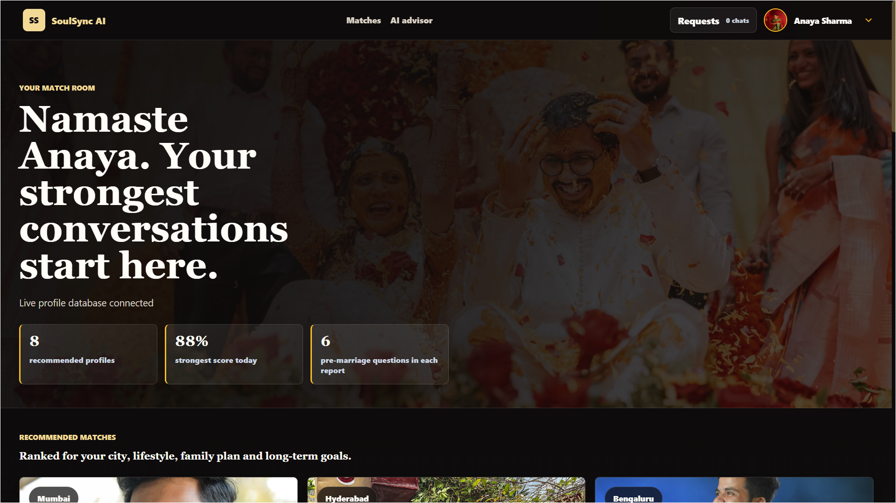
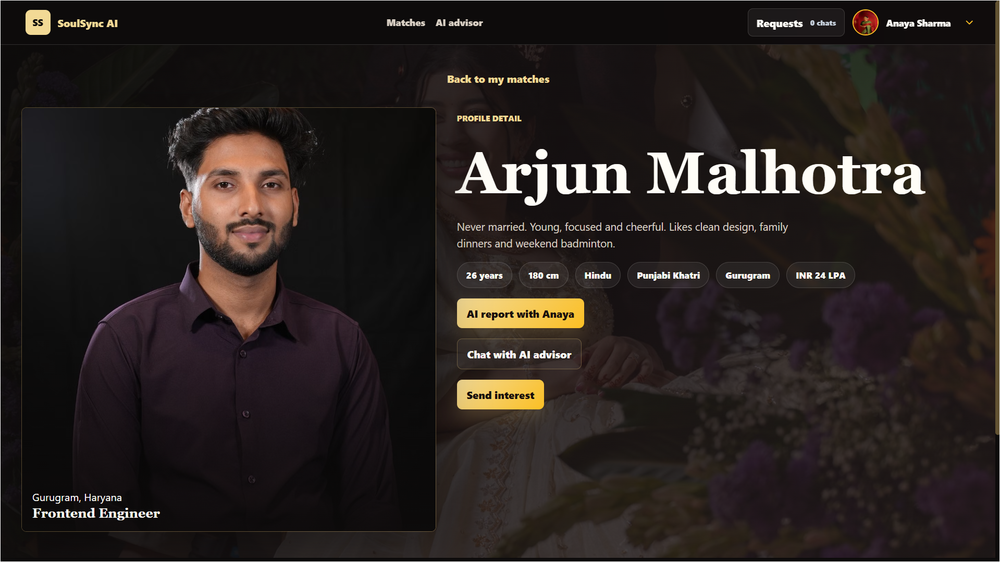
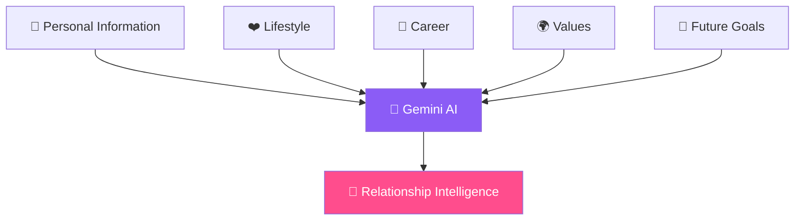
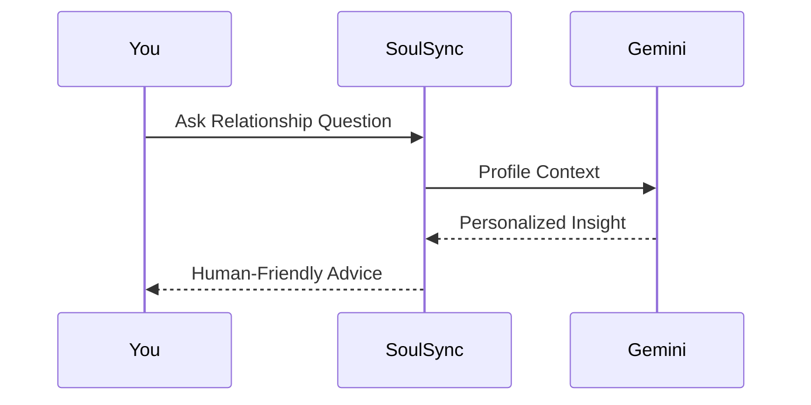
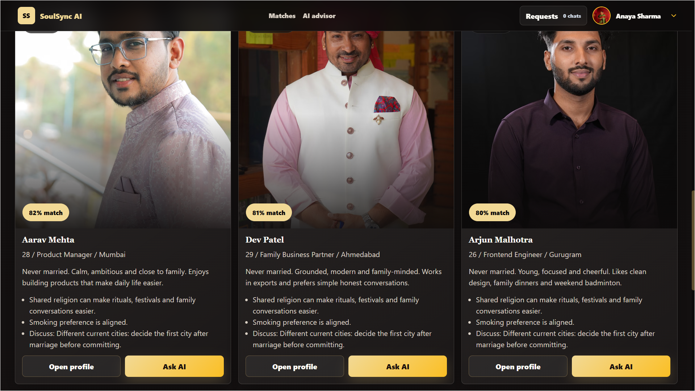
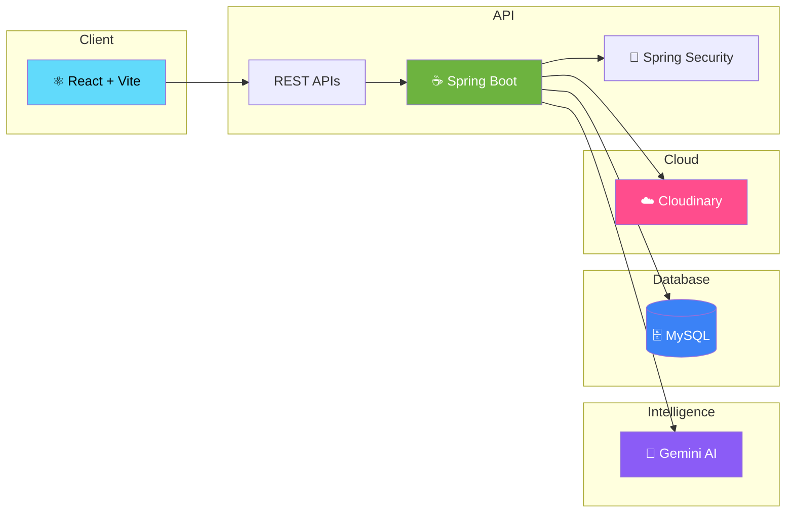
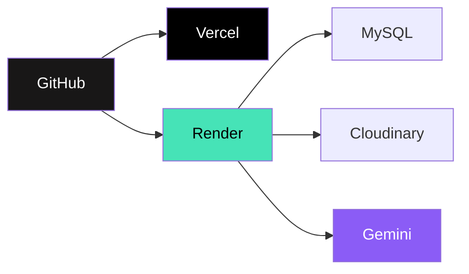
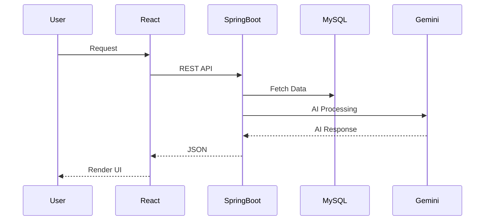

<!-- ========================================================= -->
<!--                       SOULSYNC AI                         -->
<!-- ========================================================= -->

<div align="center">


<br>


<br><br>

<a href="https://soul-sync-ai-ten.vercel.app">


</a>

&nbsp;

<a href="https://github.com/TheKanishkDev/SoulSync-AI">


</a>

&nbsp;


&nbsp;


</div>

---

<br>

# Find Someone.

# Who Understands You.

## Not Just Matches You.

<br>

Traditional matrimonial platforms stop after matching people.

**SoulSync AI doesn't.**

It studies personalities, lifestyles, communication styles, future goals and relationship expectations to help people understand **why** they are compatible—not just **whether** they match.

---

<p align="center">


</p>

---

<div align="center">

## ❤️ Every Relationship Starts With Understanding

</div>

<br>

<table>

<tr>

<td width="33%" align="center">


### AI Compatibility

Deep compatibility analysis powered by Google Gemini.

</td>

<td width="33%" align="center">


### Relationship Intelligence

Understand strengths, challenges and communication patterns.

</td>

<td width="33%" align="center">


### Real-Time Conversations

Build meaningful relationships through private messaging.

</td>

</tr>

</table>

---

<div align="center">


</div>

<br>

# A Better Way To Find Your Life Partner.

Instead of asking,

> **"Who matches my filters?"**

SoulSync AI asks,

> **"Who actually fits your life?"**

That single difference changes everything.

---

<br>


---

<div align="center">

# Product Showcase

</div>

<br>

<p align="center">



</p>

<br>

<div align="center">

### Beautiful Interface.

### Intelligent Decisions.

### Modern Relationships.

</div>

---

# Why SoulSync AI?

Most matchmaking platforms help you **discover people.**

SoulSync AI helps you **understand people.**

That means every recommendation includes:

- ❤️ Compatibility reasoning
- 🤖 AI-generated relationship insights
- 💬 Communication analysis
- 🌍 Lifestyle comparison
- 👨‍👩‍👧 Shared values
- 🎯 Long-term outlook
- 🌱 Personalized guidance

---

<div align="center">


</div>

---

<div align="center">

## ↓ Experience The AI

</div>
<!-- ========================================================= -->
<!--                  EXPERIENCE THE PRODUCT                    -->
<!-- ========================================================= -->

<div align="center">

# ✨ Experience SoulSync AI

### Every screen has a purpose.


</div>

---

# 01 · Create Your Identity

Your journey doesn't begin with swiping.

It begins with understanding **who you are.**

SoulSync AI builds a meaningful profile that captures your personality, lifestyle, goals and relationship expectations before recommending anyone.

<br>

<p align="center">


</p>

<p align="center">




</p>

---

<div align="center">

## AI Doesn't Read Profiles.

## It Understands People.

</div>



---

# 02 · AI Compatibility Report

Most apps tell you:

> **94% Match**

SoulSync AI tells you:

> **Why you're compatible.**

<br>

<p align="center">


</p>

---

<div align="center">

# Every Match Comes With A Story.

</div>

Instead of generating meaningless percentages,

Gemini AI analyzes both profiles and explains the relationship in language that people can actually understand.

<br>

<div align="center">

| ❤️ Emotional Compatibility | 💬 Communication | 🌍 Shared Values |
|:--------------------------:|:----------------:|:---------------:|
| Personality fit | Conflict style | Long-term expectations |

| 💼 Career | 👨‍👩‍👧 Family | 🌱 Growth |
|:---------:|:------------:|:---------:|
| Ambitions | Marriage vision | Personalized advice |

</div>

---

<p align="center">


</p>

---

# 03 · Ask Before You Decide

Every relationship raises questions.

SoulSync AI gives you a personal AI advisor that already understands both profiles before answering.

<br>

<p align="center">


</p>

---

<div align="center">

### Ask Naturally

</div>

```text
❤️ Are we emotionally compatible?

💬 What should we improve?

🌱 What are our strengths?

⚠️ What conflicts may arise?

👨‍👩‍👧 Are our family values aligned?

🎯 Is this relationship sustainable?
```

---



---

<div align="center">


</div>

---

<div align="center">

## ↓ From AI Insights To Real Conversations

</div>
<!-- ========================================================= -->
<!--                  BUILD THE CONNECTION                     -->
<!-- ========================================================= -->

<div align="center">

# 💬 Build The Connection

### Because finding the right person is only the beginning.


</div>

---

<p align="center">



</p>

---

# 04 · Discover People Who Truly Fit You

No endless scrolling.

No random recommendations.

No meaningless percentages.

Every suggested profile has already been analyzed by AI before it reaches you.

You spend less time searching...

and more time meeting people who genuinely fit your life.

---

<p align="center">


</p>

---

# 05 · Start Real Conversations

Once two people connect,

SoulSync AI gets out of the way.

No distractions.

No unnecessary features.

Just a clean messaging experience focused on helping two people know each other.

---

<div align="center">


</div>

---

<div align="center">


</div>

---

<!-- ========================================================= -->
<!--                    HOW IT'S BUILT                         -->
<!-- ========================================================= -->

<div align="center">

# 🏗 Engineering Behind SoulSync AI

### Modern. Secure. Scalable.

</div>

<br>

<p align="center">


</p>

---

# Built Like A Production Product

SoulSync AI follows a clean separation of responsibilities.

Each service has one job, making the application easier to maintain, extend and scale.

---

<div align="center">



</div>

---

<div align="center">

# ⚙ Tech Stack

<br>


<br><br>


</div>

---

<div align="center">

| ⚛ Frontend | ☕ Backend | 🗄 Database | ☁ Storage | 🤖 AI |
|:----------:|:----------:|:----------:|:----------:|:-----:|
| React + Vite | Spring Boot | MySQL (Aiven) | Cloudinary | Google Gemini |

</div>

---

<div align="center">


# ↓ Production Infrastructure

</div>
<!-- ========================================================= -->
<!--                 PRODUCTION & ENGINEERING                  -->
<!-- ========================================================= -->

<div align="center">

# Production Ready

### Built using modern engineering practices.

</div>

---

## Architecture Principles

<div align="center">

| 🧩 Clean Architecture | 🔐 Secure by Default | ☁ Cloud Native | ⚡ AI First |
|:--------------------:|:-------------------:|:--------------:|:----------:|
| Layered Design | JWT + Spring Security | Render + Vercel | Gemini Integration |

</div>

---

## Security

```text
✓ JWT Authentication

✓ Spring Security

✓ BCrypt Password Encryption

✓ REST API Authorization

✓ Environment Variables

✓ Protected Endpoints

✓ Cloud Image Storage

✓ Input Validation
```

---

## Deployment



---

## Request Lifecycle



---

<div align="center">

# Why This Stack?

</div>

<table>

<tr>

<td width="25%" align="center">

## ⚛

### React

Fast UI

Reusable Components

Modern UX

</td>

<td width="25%" align="center">

## ☕

### Spring Boot

REST APIs

Security

Business Logic

</td>

<td width="25%" align="center">

## 🤖

### Gemini AI

Reasoning

Compatibility

Natural Language

</td>

<td width="25%" align="center">

## ☁

### Cloud

Deployment

Storage

Scalability

</td>

</tr>

</table>

---

<div align="center">


</div>

---

# Future Vision

```text
✓ Voice Calling

✓ Video Calling

✓ Push Notifications

✓ Mobile Apps

✓ AI Voice Assistant

✓ Emotion Analysis

✓ Personality Insights

✓ Recommendation Engine v2
```

---

<div align="center">

# Built With


</div>

---

<br>

<div align="center">


</div>

<br>

<div align="center">


</div>

<br>

<div align="center">


</div>

<br>

<div align="center">


</div>

---

<br>

<div align="center">

# Meet The Developer


## Kanishk Gupta

**Full Stack Java Developer**

Building modern backend systems, AI-powered applications and cloud-native software.

<br>

<a href="https://github.com/TheKanishkDev">


</a>

&nbsp;

<a href="https://www.linkedin.com/in/kanishkagupta1609/">


</a>

&nbsp;

<a href="mailto:kanishkgupta081@gmail.com">


</a>

</div>

---

<br>

<div align="center">

# If You Like SoulSync AI

Give this project a ⭐

It helps more than you think.

<br><br>


</div>
