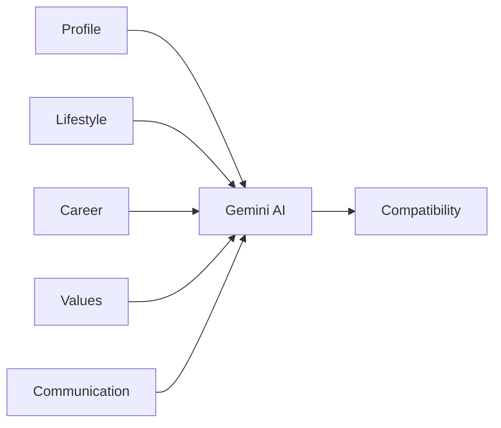
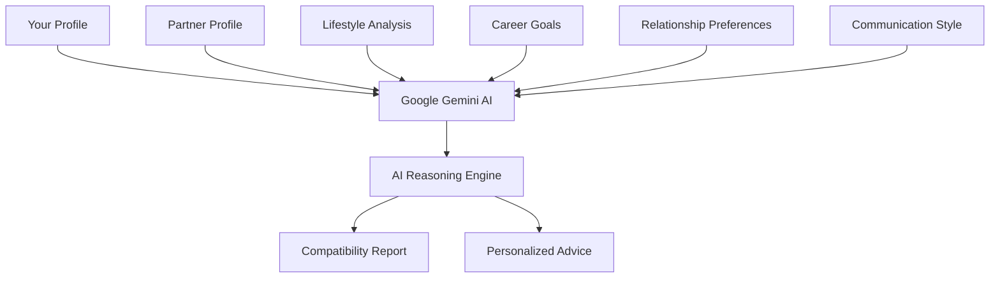
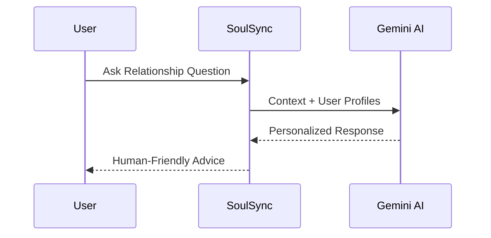

<div align="center">


<br>


<br><br>

<a href="https://soul-sync-ai-ten.vercel.app">

</a>

&nbsp;

<a href="https://github.com/TheKanishkDev/SoulSync-AI">

</a>

&nbsp;

<a href="#-features">

</a>

<br><br>


</div>

---

# ❤️ Finding the Right Person Shouldn't Feel Random.

Traditional matrimonial platforms stop at filters.

**SoulSync AI goes several steps further.**

Using **Artificial Intelligence**, it studies compatibility, relationship dynamics,
communication styles, shared values and long-term goals before recommending a match.

Instead of asking

> "Who matches my filters?"

SoulSync AI answers

> **"Who is actually compatible with me?"**

---

<div align="center">

# ✨ Built For The Modern Generation

</div>

<p align="center">


</p>

---

<div align="center">

## The Entire Journey

</div>

```text
Discover
    │
    ▼
Create Profile
    │
    ▼
AI Analysis
    │
    ▼
Compatibility Score
    │
    ▼
Detailed AI Report
    │
    ▼
Relationship Advice
    │
    ▼
Meaningful Conversation
```

---

# 🌟 Why SoulSync AI?

<div align="center">

| ❤️ Traditional Apps | 🤖 SoulSync AI |
|:-------------------:|:--------------:|
| Browse Profiles | AI understands compatibility |
| Basic Filters | Intelligent Match Ranking |
| Random Decisions | Data Driven Recommendations |
| Manual Analysis | AI Generated Reports |
| No Guidance | Relationship Advisor |
| Static Experience | Interactive AI Platform |

</div>

---

# 🧠 Meet Your AI Matchmaker

<p align="center">


</p>

Unlike ordinary matchmaking platforms,

SoulSync AI doesn't simply show profiles.

It explains:

✔ Why you're compatible

✔ Where conflicts may arise

✔ Communication strengths

✔ Shared values

✔ Long-term relationship outlook

✔ Personalized recommendations

---

# 🚀 One Platform.

### Everything You Need.

<div align="center">

| ❤️ Smart Matching | 🤖 AI Reports | 💬 AI Advisor |
|------------------|--------------|---------------|
| Intelligent recommendations | Compatibility analysis | Personalized relationship guidance |

| 📷 Cloud Storage | ⚡ Real-Time Chat | 🔐 Secure Authentication |
|-----------------|-----------------|-------------------------|
| Cloudinary | Instant messaging | JWT + Spring Security |

</div>

---

# 💎 Crafted With Modern Technologies

<p align="center">


</p>

<p align="center">


</p>

---

<div align="center">

## Scroll Down ↓

The product gets better.

</div>
---

<div align="center">

# ✨ Built Around Intelligence, Not Filters

### Every recommendation is generated with purpose.


</div>

<br>

<p align="center">


</p>

---

# ❤️ What Happens After You Sign Up?

Instead of immediately showing hundreds of random profiles...

SoulSync AI first understands **who you are.**

It analyzes your personality, preferences, career, lifestyle and future goals before recommending someone who actually fits your life.

```text
Create Account
      │
      ▼
Complete Profile
      │
      ▼
AI Studies Compatibility
      │
      ▼
Ranks Potential Matches
      │
      ▼
Generates Compatibility Insights
      │
      ▼
Meaningful Connections
```

---

<div align="center">

# 🌸 Designed To Understand People

</div>

<table>
<tr>

<td width="33%" align="center">

## ❤️ Lifestyle

Sleep Schedule

Food Preference

Smoking

Drinking

Fitness

Travel

</td>

<td width="33%" align="center">

## 💼 Career

Profession

Education

Income

Goals

Growth

Work-Life Balance

</td>

<td width="33%" align="center">

## 🌍 Values

Religion

Family

Children

Communication

Expectations

Marriage Goals

</td>

</tr>
</table>

---

<div align="center">

# 📸 Beautiful User Experience

</div>

<p align="center">


</p>

<p align="center">


</p>

---

# 🚀 More Than Just Registration

Every profile becomes the foundation for AI-powered decision making.

Instead of static biodata...

Your profile becomes a living representation of your lifestyle, ambitions and relationship expectations.

---

<div align="center">

# 🎯 AI Doesn't Guess.

## It Understands.

</div>



---

# 🌟 Core Experiences

<div align="center">

| Feature | Experience |
|:---------|:-----------|
| ❤️ Smart Matchmaking | AI ranks your most compatible matches |
| 🤖 Compatibility Engine | Understand strengths & challenges |
| 💬 AI Advisor | Ask relationship questions naturally |
| 📊 Personalized Reports | Deep compatibility analysis |
| 📷 Cloud Media | Secure profile image management |
| 🔐 Enterprise Security | JWT + Spring Security |
| ⚡ Real-Time Chat | Instant communication |
| ☁ Cloud Deployment | Always available |

</div>

---

<div align="center">

# 📈 Your Journey

</div>

```text
👤 Create Profile
        │
        ▼
🧠 AI Understands You
        │
        ▼
❤️ Finds Better Matches
        │
        ▼
📊 Explains Compatibility
        │
        ▼
💬 Helps You Communicate
        │
        ▼
🤝 Build Meaningful Relationships
```

---

<div align="center">

# 💬 Every Match Has A Story


</div>

Unlike traditional matrimonial websites that simply list profiles...

SoulSync AI tells you **why someone is recommended**, giving every match context and meaning.

---

<div align="center">

## ❤️ Because choosing a life partner deserves more than filters.

</div>

---

<div align="center">


### 🤖 Next Up → Meet the AI Brain Behind SoulSync AI

</div>
---

<div align="center">

# 🧠 Meet The Intelligence Behind SoulSync AI

### Not just Artificial Intelligence.

### **Relationship Intelligence.**


</div>

<br>

<p align="center">


</p>

---

# ❤️ Compatibility Isn't Just A Number.

Most platforms tell you

> **"92% Match."**

And that's it.

SoulSync AI believes people deserve **an explanation**, not just a score.

Instead of showing a meaningless percentage...

Gemini AI carefully studies both profiles and generates a complete compatibility report explaining:

- ❤️ Why you complement each other
- ⚠️ Potential relationship challenges
- 🌱 Areas where both people can grow
- 💬 Communication compatibility
- 👨‍👩‍👧 Family expectations
- 💼 Career alignment
- 🎯 Long-term relationship outlook

---

<div align="center">

# 🤖 How AI Thinks

</div>



---

<div align="center">

# 💎 AI Doesn't Replace Human Decisions

### It Makes Them Smarter.

</div>

SoulSync AI never decides **who you should marry.**

Instead...

It provides meaningful insights that help users make informed decisions with confidence.

Think of it as an intelligent companion rather than an automated decision-maker.

---

<div align="center">

# 📊 Inside Every AI Report

</div>

<table>

<tr>

<td align="center">

❤️

### Emotional Compatibility

</td>

<td align="center">

💬

### Communication Style

</td>

<td align="center">

🌍

### Shared Values

</td>

</tr>

<tr>

<td align="center">

👨‍👩‍👧

### Family Expectations

</td>

<td align="center">

💼

### Career Alignment

</td>

<td align="center">

🎯

### Future Goals

</td>

</tr>

<tr>

<td align="center">

⚠️

### Possible Challenges

</td>

<td align="center">

🌱

### Growth Suggestions

</td>

<td align="center">

⭐

### Overall Compatibility

</td>

</tr>

</table>

---

<div align="center">

# 💬 Your Personal AI Relationship Advisor

</div>

<p align="center">


</p>

---

Imagine having an experienced relationship mentor available **24×7.**

That's exactly what the AI Advisor is designed to be.

Whether you're unsure about compatibility or simply looking for guidance...

Just ask.

---

## 💭 Ask Questions Naturally

```text
❤️ Are we emotionally compatible?

💬 How can we communicate better?

🌍 Will our lifestyles match?

👨‍👩‍👧 Are our family values aligned?

💼 Can career differences become a problem?

🎯 What should we improve before marriage?

🤝 Are there any hidden challenges?

🌱 What are our strongest qualities together?
```

---

<div align="center">

# 🧠 AI Conversation Flow

</div>



---

<div align="center">

# ⚡ Fast.

### Intelligent.

### Personalized.

</div>

<table>

<tr>

<td width="33%" align="center">

## 🧠

Prompt Engineering

Optimized prompts produce structured, meaningful and context-aware responses.

</td>

<td width="33%" align="center">

## ⚡

Fast Processing

AI responses are generated in just a few seconds while maintaining quality.

</td>

<td width="33%" align="center">

## ❤️

Personalized

Every response is unique because every relationship is unique.

</td>

</tr>

</table>

---

<div align="center">

# 🌟 Why This Matters

</div>

Traditional platforms help you **find people.**

SoulSync AI helps you **understand people.**

That's the difference.

---

<div align="center">


## 💬 Next → Real-Time Messaging Experience

</div>
