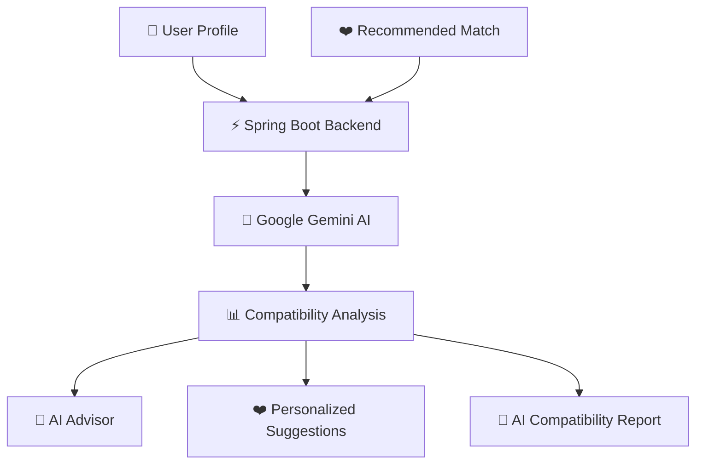
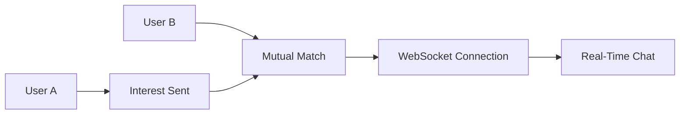
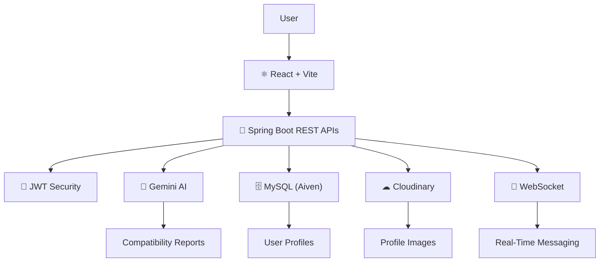
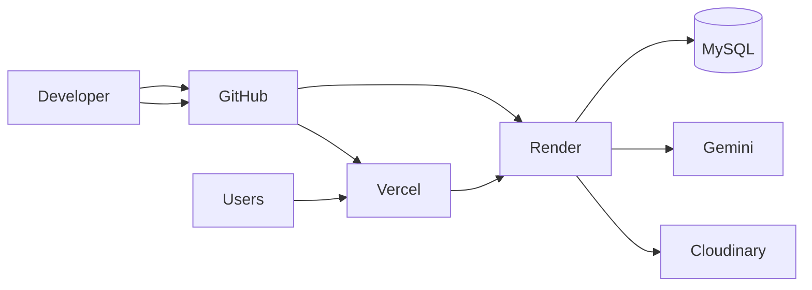

<!-- ===================================================== -->
<!--                 PART 1 - HERO SECTION                  -->
<!--        Replace everything from the top till About      -->
<!-- ===================================================== -->

<div align="center">


</div>

<br>

<div align="center">


</div>

---

<div align="center">

<a href="https://soul-sync-ai-ten.vercel.app">

</a>

<a href="https://github.com/TheKanishkDev/SoulSync-AI">

</a>

</div>

---

<div align="center">


</div>

---

<div align="center">

## ⚡ Quick Navigation

<a href="#about">About</a> •
<a href="#features">Features</a> •
<a href="#preview">Preview</a> •
<a href="#architecture">Architecture</a> •
<a href="#tech-stack">Tech Stack</a> •
<a href="#installation">Installation Guide</a>

</div>

---

<p align="center">


</p>

# ✨ Why SoulSync AI?

> Traditional matrimonial platforms focus only on profile filtering.

SoulSync AI revolutionizes matchmaking by combining **Artificial Intelligence**, **Compatibility Analytics**, and **Relationship Guidance** into one intelligent platform.

Instead of simply suggesting profiles...

It understands **people.**

---

<div align="center">

| ❤️ Traditional Platforms | 🤖 SoulSync AI |
|:-------------------------|:---------------|
| Manual Profile Search | AI Assisted Matchmaking |
| Static Biodata | Dynamic Compatibility Reports |
| No Guidance | AI Relationship Advisor |
| Basic Filters | Intelligent Recommendations |
| Manual Decisions | AI Driven Insights |

</div>

---

<div align="center">

# 🚀 Project Highlights

</div>

<div align="center">

<table>

<tr>

<td align="center" width="25%">

### 🤖

### Gemini AI

AI Powered Reports

</td>

<td align="center" width="25%">

### ❤️

### Smart Matchmaking

Intelligent Recommendations

</td>

<td align="center" width="25%">

### 💬

### Real-Time Chat

Instant Messaging

</td>

<td align="center" width="25%">

### ☁️

### Cloud Native

Production Deployment

</td>

</tr>

</table>

</div>

---

<div align="center">


</div>

---

<p align="center">


</p>
<!-- ===================================================== -->
<!--              PART 2 - ABOUT + FEATURES                -->
<!-- ===================================================== -->

<a id="about"></a>

<div align="center">

# 🌟 About SoulSync AI


</div>

<br>

<table>

<tr>

<td width="55%">


### 💖 Intelligent Matchmaking

SoulSync AI is a modern AI-powered matrimonial platform that transforms traditional matchmaking into an intelligent and personalized experience.

Instead of relying only on static profile filters, the platform leverages **Google Gemini AI** to analyze compatibility, generate personalized relationship guidance, and recommend highly compatible matches.

---

### 🚀 What makes it unique?

✔ AI Compatibility Analysis

✔ Personalized Relationship Guidance

✔ AI Relationship Advisor

✔ Smart Match Recommendations

✔ Real-Time Messaging

✔ Cloud Native Architecture

✔ Secure Authentication

✔ Modern Responsive Interface

</td>

<td width="45%">


</td>

</tr>

</table>

---

<div align="center">

# 🎯 Core Objectives

</div>

<table>

<tr>

<td align="center">

🧠

### AI Powered

Generate intelligent compatibility insights.

</td>

<td align="center">

❤️

### Better Matches

Find meaningful relationships instead of random profiles.

</td>

<td align="center">

💬

### Communication

Enable secure conversations after mutual interest.

</td>

<td align="center">

☁️

### Cloud Native

Deploy scalable production-ready architecture.

</td>

</tr>

</table>

---

<p align="center">


</p>

<a id="features"></a>

<div align="center">

# 🚀 Core Features


</div>

<br>

<table>

<tr>

<td align="center" width="33%">

## 👤

### User Management

Secure Login

JWT Authentication

Profile Management

Cloudinary Uploads

Responsive Dashboard

</td>

<td align="center" width="33%">

## ❤️

### Matchmaking

AI Recommendations

Compatibility Ranking

Interest Requests

Detailed Profiles

Smart Discovery

</td>

<td align="center" width="33%">

## 🤖

### Artificial Intelligence

Gemini AI Advisor

Compatibility Reports

Relationship Suggestions

Conversation Guidance

AI Insights

</td>

</tr>

<tr>

<td align="center">

## 💬

### Messaging

Real-Time Chat

WebSockets

Mutual Match Chat

Secure Messaging

Instant Delivery

</td>

<td align="center">

## ☁️

### Cloud

Render Deployment

Vercel Hosting

Cloudinary

Aiven MySQL

Scalable Infrastructure

</td>

<td align="center">

## 🔒

### Security

JWT Tokens

Password Encryption

Protected APIs

CORS Security

Environment Variables

</td>

</tr>

</table>

---

<div align="center">

# ⭐ Feature Comparison

</div>

| Feature | Traditional Apps | SoulSync AI |
|:---------|:----------------:|:-----------:|
| AI Compatibility | ❌ | ✅ |
| Personalized Reports | ❌ | ✅ |
| AI Relationship Advisor | ❌ | ✅ |
| Real-Time Chat | ⚠️ Limited | ✅ |
| Smart Match Ranking | ❌ | ✅ |
| Cloud Native Deployment | ❌ | ✅ |
| Responsive UI | ⚠️ | ✅ |

---

<div align="center">

# 💎 Platform Highlights

</div>

```text
🤖 Google Gemini AI

❤️ AI Relationship Advisor

📊 Compatibility Reports

💬 Real-Time Chat

🔐 JWT Authentication

📷 Cloudinary Uploads

☁️ Cloud Deployment

⚡ Spring Boot REST APIs

🗄️ Aiven MySQL

🎨 Modern React UI
```

---

<p align="center">


</p>
<!-- ===================================================== -->
<!--            PART 3 - LIVE DEMO + PREVIEW               -->
<!-- ===================================================== -->

<p align="center">


</p>

<a id="preview"></a>

<div align="center">

# 🖥 Live Demo


</div>

<br>

<div align="center">

<a href="https://soul-sync-ai-ten.vercel.app">


</a>

&nbsp;&nbsp;

<a href="https://soulsync-ai-8hyt.onrender.com">


</a>

&nbsp;&nbsp;

<a href="https://github.com/TheKanishkDev/SoulSync-AI">


</a>

</div>

---

<div align="center">

# 📸 Application Showcase

</div>

> **A complete AI-powered matrimonial experience from registration to intelligent compatibility analysis.**

---

# 🏠 Landing Experience

<p align="center">

<a href="Assets/Landing Page.png">


</a>

</p>

<div align="center">

### ✨ First impressions matter.

Beautiful modern landing page introducing the platform, highlighting AI-powered matchmaking, and encouraging users to begin their journey.

</div>

---

# 🔐 Secure Authentication

<table>

<tr>

<td width="50%">

<a href="Assets/Login Page.png">


</a>

</td>

<td width="50%">

### Authentication Features

✅ Secure Login

✅ JWT Authentication

✅ Session Management

✅ Responsive Design

✅ Protected Routes

</td>

</tr>

</table>

---

# 📝 User Registration

<table>

<tr>

<td>

<a href="Assets/Signup page 1.png">


</a>

</td>

<td>

<a href="Assets/Signup page 2.png">


</a>

</td>

</tr>

</table>

<div align="center">

### 👤 Create Your Complete Matrimonial Profile

Provide lifestyle, education, profession, family preferences, interests, and personal details to receive AI-powered recommendations.

</div>

---

# 📊 Personalized Dashboard

<p align="center">

<a href="Assets/Dashboard.png">


</a>

</p>

<table>

<tr>

<td align="center">

🤖

### AI Suggestions

</td>

<td align="center">

❤️

### Match Overview

</td>

<td align="center">

💬

### Advisor Access

</td>

<td align="center">

📈

### Compatibility Insights

</td>

</tr>

</table>

---

# ❤️ Recommended Matches

<p align="center">

<a href="Assets/Matches.png">


</a>

</p>

### Intelligent Ranking Factors

| 📍 | 🎓 | 💼 | ❤️ | 🚭 |
|:--:|:--:|:--:|:--:|:--:|
| Location | Education | Career | Lifestyle | Habits |

| 👨‍👩‍👧 | 🛕 | 👶 | 🎯 | 🤖 |
|:--:|:--:|:--:|:--:|:--:|
| Family | Religion | Children | Goals | AI Score |

---

# 👤 Detailed Match Profile

<p align="center">

<a href="Assets/Profile.png">


</a>

</p>

### Rich Profile Information

```text
👤 Age

📏 Height

💼 Occupation

💰 Income

📍 City

🛕

Religion

👨‍👩‍👧 Family Preferences

❤️ Lifestyle

📝 Personal Bio

🤖 AI Report

💬 AI Advisor

💖 Send Interest
```

---

<p align="center">


</p>
<!-- ===================================================== -->
<!--      PART 4 - AI FEATURES + CHAT + ARCHITECTURE       -->
<!-- ===================================================== -->

<p align="center">


</p>

<a id="ai-features"></a>

<div align="center">

# 🤖 Artificial Intelligence Engine


</div>

<br>

<div align="center">

> **Artificial Intelligence is the heart of SoulSync AI.**
>
> Instead of simply recommending profiles, SoulSync AI deeply analyzes compatibility,
> generates personalized relationship insights,
> highlights strengths & concerns,
> and even guides conversations before marriage.

</div>

---

<div align="center">

# ⚡ AI Workflow

</div>



---

<div align="center">

# 📊 AI Compatibility Report

</div>

<p align="center">

<a href="Assets/AI report 1.png">


</a>

</p>

---

<table>

<tr>

<td width="50%">

### 📈 Overall Compatibility

✔ AI Compatibility Score

✔ Relationship Summary

✔ Confidence Percentage

✔ Overall Recommendation

</td>

<td width="50%">

### ❤️ Relationship Insights

✔ Positive Factors

✔ Potential Challenges

✔ Compatibility Breakdown

✔ Personalized Suggestions

</td>

</tr>

</table>

---

<p align="center">

<a href="Assets/AI report 2.png">


</a>

</p>

---

<div align="center">

# 🔍 AI Compatibility Parameters

</div>

| Category | AI Analysis |
|:---------|:-----------|
| 📍 Location | Geographic Compatibility |
| 🌱 Lifestyle | Daily Lifestyle Matching |
| 💼 Career | Career Stability |
| 👨‍👩‍👧 Family | Family Expectations |
| 👶 Children | Future Planning |
| 💬 Communication | Communication Readiness |
| ❤️ Personality | Relationship Potential |
| 🎯 Goals | Long-Term Vision |

---

<p align="center">

<a href="Assets/AI report 3.png">


</a>

</p>

---

<div align="center">

# 💡 AI Recommendations

</div>

```text
✅ Compatibility Highlights

⚠️ Possible Concerns

💬 Suggested Conversation Topics

❤️ Long-Term Recommendation

🎯 Future Compatibility Prediction

📈 AI Generated Insights
```

---

<p align="center">


</p>

<div align="center">

# 💬 AI Relationship Advisor

</div>

<p align="center">

<a href="Assets/AI chat advisor.png">


</a>

</p>

---

The **AI Relationship Advisor** enables users to ask personalized questions about any recommended profile and instantly receive context-aware responses powered by **Google Gemini AI**.

---

### Example Questions

```text
❤️ Is this profile suitable for me?

💬 What should I ask before marriage?

🤖 What are our strongest compatibility factors?

⚠️ Which areas may require discussion?

📈 What is the long-term compatibility?

🎯 What makes this recommendation unique?
```

---

<div align="center">

<table>

<tr>

<td align="center">

🤖

### Gemini AI

</td>

<td align="center">

🧠

### Prompt Engineering

</td>

<td align="center">

📊

### Smart Analysis

</td>

<td align="center">

💬

### Natural Responses

</td>

</tr>

</table>

</div>

---

<p align="center">


</p>

<div align="center">

# 💬 Real-Time Personal Chat


</div>

---

<table>

<tr>

<td width="55%">

### ⚡ Features

✔ WebSocket Based Communication

✔ Instant Message Delivery

✔ Mutual Match Requirement

✔ Secure Conversations

✔ Responsive Chat Interface

✔ Private Communication

</td>

<td width="45%">

<a href="Assets/Personal Chat1.png">


</a>

</td>

</tr>

</table>

---

<p align="center">

<a href="Assets/Personal chat2.png">


</a>

</p>

---

> Users can communicate only after expressing **mutual interest**, ensuring privacy and creating a safer matchmaking experience without sharing personal contact information.

---

<div align="center">

# 🚀 Chat Workflow

</div>



---

<p align="center">


</p>

<a id="architecture"></a>

<div align="center">

# 🏗️ System Architecture


</div>

---



---

<div align="center">

# ☁️ Cloud Infrastructure

</div>

| Layer | Technology |
|:------|:-----------|
| 🎨 Frontend | React + Vite |
| ⚙ Backend | Spring Boot |
| 🤖 AI | Google Gemini |
| 🗄 Database | MySQL (Aiven) |
| ☁ Storage | Cloudinary |
| 🚀 Frontend Hosting | Vercel |
| ⚡ Backend Hosting | Render |
| 💬 Messaging | WebSockets |

---

<p align="center">


</p>
<!-- ===================================================== -->
<!-- PART 5 - TECH STACK + INSTALLATION + DEPLOYMENT       -->
<!-- ===================================================== -->

<p align="center">


</p>

<a id="tech-stack"></a>

<div align="center">

# 💻 Tech Stack


</div>

<br>

<div align="center">


</div>

---

<div align="center">

| Category | Technologies |
|:---------|:-------------|
| 🎨 Frontend | React 19, Vite, CSS3 |
| ⚙ Backend | Spring Boot 3, Spring Data JPA, REST APIs |
| 🤖 Artificial Intelligence | Google Gemini AI, Prompt Engineering |
| 🗄 Database | MySQL (Aiven Cloud) |
| 🔐 Authentication | JWT |
| ☁ Cloud | Render, Vercel, Cloudinary |
| 💬 Communication | WebSockets |
| 🛠 Tools | Git, GitHub, IntelliJ IDEA, VS Code, Postman |

</div>

---

<div align="center">

# 🚀 Technology Overview

</div>

<table>

<tr>

<td align="center">

☕

### Java 21

Enterprise Backend

</td>

<td align="center">

🌱

### Spring Boot

REST APIs

</td>

<td align="center">

⚛️

### React

Interactive UI

</td>

<td align="center">

🤖

### Gemini AI

Smart Intelligence

</td>

</tr>

<tr>

<td align="center">

🗄

### MySQL

Cloud Database

</td>

<td align="center">

☁️

### Cloudinary

Image Storage

</td>

<td align="center">

🚀

### Render

Backend Hosting

</td>

<td align="center">

▲

### Vercel

Frontend Hosting

</td>

</tr>

</table>

---

<p align="center">


</p>

<div align="center">

# 📂 Project Structure

</div>

```
SoulSync-AI
│
├── 📁 Backend
│   ├── 🎮 Controllers
│   ├── ⚙ Services
│   ├── 📦 Repositories
│   ├── 📄 Models
│   ├── 📋 DTOs
│   ├── 🔐 Security
│   ├── ⚡ Configuration
│   ├── 🤖 AI Module
│   └── 🌐 REST APIs
│
├── 📁 Frontend
│   ├── 🧩 Components
│   ├── 📄 Pages
│   ├── 🖼 Assets
│   ├── 🎣 Hooks
│   ├── 🌍 Context
│   ├── 🎨 Styles
│   └── 🔗 Services
│
└── 📄 README.md
```

---

<div align="center">

# ⚙️ Installation Guide

</div>

## 1️⃣ Clone Repository

```bash
git clone https://github.com/TheKanishkDev/SoulSync-AI.git

cd SoulSync-AI
```

---

## 2️⃣ Frontend Setup

```bash
cd Frontend

npm install

npm run dev
```

---

## 3️⃣ Backend Setup

```bash
cd Backend

mvn clean install

mvn spring-boot:run
```

---

<div align="center">

# 🔐 Environment Variables

</div>

Create an **application.properties** file.

```properties
SPRING_DATASOURCE_URL=

SPRING_DATASOURCE_USERNAME=

SPRING_DATASOURCE_PASSWORD=

GEMINI_API_KEY=

CLOUDINARY_CLOUD_NAME=

CLOUDINARY_API_KEY=

CLOUDINARY_API_SECRET=
```

---

<div align="center">

# ☁️ Deployment

</div>

| Service | Platform |
|:---------|:---------|
| 🎨 Frontend | Vercel |
| ⚙ Backend | Render |
| 🗄 Database | Aiven MySQL |
| ☁️ Image Storage | Cloudinary |
| 🤖 Artificial Intelligence | Google Gemini |

---

<div align="center">

# ⚡ Production Infrastructure

</div>



---

<div align="center">

# 🔒 Security Features

</div>

| 🔐 Feature | Status |
|:----------|:------:|
| JWT Authentication | ✅ |
| Password Encryption | ✅ |
| Protected REST APIs | ✅ |
| Environment Variables | ✅ |
| CORS Protection | ✅ |
| Cloud Database | ✅ |
| Secure Image Upload | ✅ |

---

<div align="center">

# 📈 Performance Highlights

</div>

```text
⚡ Fast React Rendering

🚀 Optimized Spring Boot APIs

☁ Cloud Native Deployment

📷 CDN Image Delivery

🗄 Optimized MySQL Queries

🤖 AI Generated Responses

💬 Low-Latency Messaging

📱 Responsive User Interface
```

---

<div align="center">

# 🛣 Future Enhancements

</div>

| Feature | Status |
|:---------|:------:|
| AI Compatibility Reports | ✅ |
| AI Relationship Advisor | ✅ |
| Match Recommendation Engine | ✅ |
| Real-Time Chat | ✅ |
| Voice AI Assistant | 🔜 |
| Video Calling | 🔜 |
| Push Notifications | 🔜 |
| Mobile Application | 🔜 |
| AI Voice Matchmaker | 🔜 |
| Multi-language Support | 🔜 |

---

<div align="center">

# 🤝 Contributing

</div>

```bash
# Fork Repository

# Create New Branch

git checkout -b feature/new-feature

# Commit Changes

git commit -m "Added Amazing Feature"

# Push

git push origin feature/new-feature

# Open Pull Request 🚀
```

---

<div align="center">

# 👨‍💻 Developer


### Computer Science Engineer

Passionate about building scalable backend systems, AI-powered applications, and solving real-world problems using modern technologies.

<br>

<a href="https://github.com/TheKanishkDev">


</a>

</div>

---

<div align="center">

# ⭐ Support This Project

If you found this project useful...

🌟 Star the Repository

🍴 Fork the Repository

💬 Share Feedback

❤️ Connect with Me

</div>

---

<div align="center">


### Made with ❤️ by **Kanishk Gupta**


</div>
